# Client Server Architecture

1. Client is a computer which is capable of sending request to other computers present in interenet.
2. We say client as a computer but in reality browser software is termed as a client.

# Server

1. It is a computer which has a capability to provide output to any number of clients.
2. Normally a server computer would be referred as high configuration computer.
3. Inside the server computer we install a server software called "web-server" (Ex's., Tomcat, glassfish, wildfly, Jboss)

Installing nodejs will promote a build tool through which we can automate the process of taking third party libraries from different websites to our project with the help of a command called "npm"

Q. What is a website, internet, web?

# HTML Parsing

On a browser to display the content. Our requirement we need to markup our content.

To markup the content on a browser, we need language called HTML.

# Evolution of HTML

1. GML - It stnads for Generic Markup Langauge
2. SGML - It stands for Standard Generic Markup Langauge, it is add on to the GML.
3. Tim Berner Lee introduced a new markup language called as HTML which is a subset of SGML.
4. Initially HTML was a open-source langauge.
5. HTML was introduced as a communicating langauge to web by Tim Berner Lee.
6. HTML is maintained by a community called "WhatWG"
7. HTML-4 version didn't gave importance for SEO and responsive design.
8. In HTML-5 different <u>semantics</u>(elements) to give importance for SEO and resposive designs.

- NOTE: SEO refers to Search Engine Optimisation

8. Whenever we type some content on a browser which needs to be searched on google search engine uses SEO technique(Robos like bot, web crawlers, web spider,... etc)

### Categories of HTML elements

1. Normal Elements - `<b>`
2. Void Elements - ``

3. RC(Rich Context) Data Elements

    Ex.:

    ```
        <textarea>
            <p>Hello pw'ian</p>
        </textarea>
    ```

Ouptut:
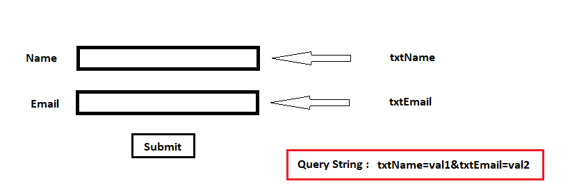

4. Raw Text Element

Ex.:

```
Temperature25C 4500/-
```

```
Temperature25&deg;C &#8377;4500/-
```


5. Foreign Elements - ex. svg, mathml

## Structure of HTML

Arranging the elements of HTML in a hierarchial way to a present on a webpage is called "DOM"(Document Object Model).

Skeletal Structre:

```
<html>
    <!-- Document scope -->
    <head>
    </head>

    <body>
    </body>
</html>
```

The content presented in head section is mainly used for SEO and responsive design.

The elements which can be written inside `<head>` section are:

1. `<title>`
2. `<link>`
3. `<meta>`
4. `<style>`
5. `<script>`

- `<!DOCTYPE html>` - It is indication to browser engine that in the body section we use elements of html-5.
- `<html lang = "en-IN">` - It is indication to browser engine that the output should be feasible to the end-user in a particular format.

## Body Section(Dynamic content)

- Attributes of body tag:

1. bgcolor - this attribute is used to set the background color for the body section
2. text - this attribute is used to set a different color valuefor the content to be presented on a webpage.

Ex.: `<body bgcolor = "black" text = "white"> </body>`

- To control the elements of a webpage after the presentation we go for CSS(Styling language)

CSS attributes for background:

1. background-repeat : repeat| non-repeat| repeat-x| repeat-y
2. background-size : contain| cover| auto |width&height in pixels
3. background-position : top| center| right| left
4. background-attachment : fixed | scroll

### HTML5 new semantics(Elements)

1. Header
2. Section
3. Nav
4. Main(Entry point)
5. Article
6. Figure
7. FigCaption
8. Dialog
9. Aside
10. Footer
11. Div
12. Span

## Div v/s Span

The `<span>` tag is myuch like the `<div>` element, but `<div>` is a bloack-level element and `<span>` is an inline element.

Padding is used to create space around an element's content, Inside

1. To align the content in column wise in css we use have an option called `display: flex;`
2. We can control the attributes of font through css using

   - `font-family:`, `font-style:`, `font-size:`, `font-weight:`,

3. For a span element width property can't be applied directly (no effect). To see the effect we use attribute called `display: inline-block;`

- Default screen width is 1200px, so max no. of columns in a page is 12.

### Different Types of css selector

1. Selecting child and sibling in css

   :

   parent child { ==> Child Selector

   }

   ElementA + ElementB { => Adjacent Building

   }

   ElementA ~ ElementB { => All elements after specific

   }

- For any image to be blurred and if the content has to be presented on a blurred image we go for an attribute called `background-color: rgba();`, "a" stands for alpha and range of alpha is 0 to 1.
- To display any content to the center (Horizontal and Vertical):

  1. Keep all the the content in one contaier
  2.

  ```
  <body>
      <div>
          // Your content here
      </div>
  </body>
  ```

  3. Body is the container here which would display the contents center with attributes

  ```
  body {
      display: flex;
      justify-content: center;
      align-items: center;
      height: 100vh;
  }
  ```

  Note:

  - justify-content

- Figcaption element is used by searche engine to load the image as a search result for the end user.

```
<figure>
        <div>
            <!-- PLACE IMAGE -->
        </div>

        <figcaption>
            Browser Image
        </figcaption>
    </figure>
```

- Element designed for coding platforms

  1. `<code></code>` - To indicate the presentation content is for programming
  2. `<var></var>` - To indicate the browser engine that it is a variable
  3. `<samp></samp>` - To indicate the description about program we use `</samp>` element.

- What is difference b/w `<br>` and `<br/>`?

1. There is not such element called "`<br>`" in HTML.

- `<pre>` - It is used to preserve the whitespaces in particular container

- `&nbsp;` - It is used to mark the spaces set by the user for any element

#### Small Text and Big Text

- `<small>content</small>` :: It sets letter size smaller
- `<big>content</big>` :: It sets letter size large

#### Details and summary

Syntax:

```
<details>
    <summary>content</summary>
</details>
```

#### Details and summary

- It is used to display the content in detail only when required.
- It allows to expand and collapse your content.
- It saves the screen space

## Data List with Terms and definitions:

```
<dl>
    <dt>Term</dt>
    <dd>Definition</dd>
    <dt>Term</dt>
    <dd>Definition</dd>
    <dd>Definition</dD>
</dl>
```

Note:

- `<dt>` and `<dd>` will have some default alignment, so it is easy for presentation.
- `<dl>` has the capability to display in columns using grid (`<dt>` -> one column an `<dd>` -> one column)

Note:

```
dt {
     position: sticky;
     top: 0;
}
```

NOte:
In Css we can set shadow to any container by using box-shadow attribute.

- Box shadow will have 4 values

```
{
    box-shadow: horizontal vertical blur color;
}
```

## Heading elements in HTML

- Heading elements are mainly used to define headings and to describe a <u>topic</u> in a webpage
- Heading element default behaviour is:

  1. Display -> block
  2. font-weight -> Bold
  3. font-size -> vary according to hn : 1 to 6 -> the size will decrease

Q. 3 Can we change the apperance of `<hn>` tags?

Ans :

> Through css we can change the default behaviour.

```
h1 {
    font-size: 50px;
    font-weight: lighter;
    color: blue;
}
```

Q. 4 Can we remove the default style defined for heading?

Ans:

> Yes it can be made possible with the help of css Inheritence.

```
h1 {
    text-align: center;
    display: unset;
    font-size: unset;
    font-weight: unset;
}

h2 {
    all: unset;
}
```

## Working with paragraphs

1. `<p></p>` - To present the content in the form of paragraph we use `<p>` element.

- It supports "align" attribute, which can set text left, center, right or justified.
- paragraphs will have a line break before and after.

2. `<blockquote></blockquote> ` - It is used to present summary of content in. By default the behaviour would have left right indentation and some margin bvalue for blockquote.

Q. How to set the first-line indent for paragraph or blockquote?
using css attribute `text-indent: __px`

Q. how to set line space, word space, character space in a paragraph

Using CSS attributes `line-height:, word-spacing:, letter-spacing:`.

Ex.:

```
blockquote {
    text-indent: 50px;
    line-height: 30px;
    word-spacing: 7px;
    letter-spacing: 3px;
}
```

Q. How to set dropcap?

- By using the following style we can set dropcap:

  - Access the first letter using the class : first-letter
  - After accessing the firstletter apply fonts[size, weight, family]
  - Apply css float

- Difference between display: grid; vs column: ; of a css attribute

  1. display: grid; would display the content column wise in the given frame width(column ratio).
  2. columns:; this attribute take number of columns as the input and display the content in continuous

## Text Formatting In HTML

- We can change the text formatting using font
  font: we can change the face (family), size and color.

face - font family

color - It represents color name and color code

size - 1 to 7 (increasing order)

```
<font face = " " size = "" color = ""> Your Text </font>
```

- HTML attribute for style

  | Tag            | Design Team | Review Team | Output            |
  | -------------- | ----------- | ----------- | ----------------- |
  | Bold           | `<b>`       | `<strong>`  | <b>Bold</b>       |
  | Italic         | `<i>`       | `<em>`      | <i>Italic</i>     |
  | Underline      | `<u>`       | `<ins>`     | <u>Underline</u>  |
  | To strike down | `<strike>`  | `<del>`     | <del>Strike</del> |

- What are web safe fonts:

> These fonts are such fonts which would be available in every machine and it can't be deleted .

Ex: sans-serif, mono space, serriff

## Ordered And undorderd List

- Order list will add auto numbering for a list of option, which can update automatically when your add or delete items.
- Orders list is defined by using `<ol>` element
- Itemns in list are defined by using `<il>`

Syntax:

```
<ol>
    <li>Itme-1</li>
    <li>Itme-2</li>
<ol>
```

Note : Default numbering will be given for items

`type` : It specified the numbering type, which can be: a, A, i, I, 1(default)

`start`[number] - It defines the numbering level to start with.

## Nesting in list elements

Bad Code

```
<ol>
    <li>Front End</li>
        <ol type = "a">
            <li>HTML</li>
            <li>CSS</li>
        </ol>

    <li>Back End</li>
        <ol type = "a">
            <li>Node JS</li>
            <li>MongoDB</li>
        </ol>

</ol>
```


Good Code

```
<ol>
    <li>Front End
        <ol type = "a">
            <li>HTML</li>
            <li>CSS</li>
        </ol>
    </li>

    <li>Back End
        <ol type = "a">
            <li>Node JS</li>
            <li>MongoDB</li>
        </ol>
    </li>

</ol>
```


Questions:

1. How to remove numbering in orderlist?

   Ans

   > It is possible to remove numbering of ordered list element throught a css attribute called `list-style: none;`

2. How to create scrollable list?
   Ans

   > Keep a Border, Keep a proper width and height as per the content area. Using an css attribute `overflow: hidden | scroll | auto`.

3. How to display list items inline?
4. How to display li in columnss wise?

   i.

```
ol {
    display : grid;
    grid-template-columns: 6fr 6fr;
}
```

```
ol {
    columns: 2;
}
```

5. How to change the options in ordered list?

## Unordered List

Syntax:

```
<ul type = "square">
    <li>Web Server</li>
    <li>Web Site</li>
    <li>Web Page</li>
</ul>
```

How to set up custom bullets?

Ans: We can do by using `list-style-image:;` attribute of css.

## Pagination

-- It refers to the process of displaying the records by splitting them into <u>pages</u>.

```
<ul>
    <li><span>&laquo;</span></li>
    <li><span>1</span></li>
    <li><span>2</span></li>
    <li><span>3</span></li>
    <li><span>4</span></li>
    <li><span>5</span></li>
    <li><span>....</span></li>
    <li><span&raquo;</span></li>
</ul>
```

We can use only those images from google which are filtered using : Creative common licenses. So that our website we don't get copyright.

from -> tools

> Different types of images:

| Sr Number | Abbreviation | FileFormat                         | MIMEType      | FileExtension                   |
| --------- | ------------ | ---------------------------------- | ------------- | ------------------------------- |
| 1.        | APNG         | Animated Portable Network Graphics | image/png     | .apng                           |
| 2.        | BMP          | Bitmap File                        | image/bmp     | .bmp                            |
| 3.        | GIF          | Graphics Interchange Formage       | image/gif     | .gif                            |
| 4.        | ICO          | Microsoft Icon                     | image/x-icon  | .ico, .cur                      |
| 5.        | JPEG         | Joint Phototgraphic Expert Group   | image/jpeg    | .jpg. jpeg, .jtif, .pjpeg, .pjp |
| 6.        | PNG          | Portable Network Graphics          | image/png     | .png                            |
| 7.        | SVG          | Scalar Vector Graphics             | image/svg+xml | .svg                            |
| 8.        | TIFF         | Tagged Image File Format           | image/tiff    | .tiff, .tif                     |
| 9.        | WEBP         | Web Picture Format                 | image/webp    | .webp                           |

Q. What is MIME Type ?

- MIME stands for "Multipurpose Internet Mail Extension"

- Server upon sending the information to the browser, it will also send what type of information is being send.

- To inform the type of information we go for MIME Type.

Purpose of different types of images:

| Type | Purpose                                                                            |
| ---- | ---------------------------------------------------------------------------------- |
| PNG  | High resolution(More space), Suitable for downloads                                |
| JPG  | Compressed Image Format(Less Space) , Good for on screen presentation              |
| GIF  | Low Resolution, used for animations                                                |
| SVG  | Ex. : 1. Google Map, 2. Bootstrap Icons, not pixel based, high zoom quality        |
| WEBP | If we try to save an image it saves the entire page. Image alone can't be captured |

Embedding an image in webpage:

- It is a void element
- `` is configure with following attributes
  ``

Ex 1:

```
<figure>
        
        <figcaption>IPHONE</figcaption>
    </figure>
```

Card

Standard Card Templated -

<div style = "border: 1px solid white">
<h2 align="center" style = "border: 1px solid white">Card Header</h2>

<div style = "display:flex; justify-content:center; border: 1px solid white;" >
    Card Body
</div>

<div style = "border: 1px solid white;">
Card Footer
</div>
</div>

<hr>

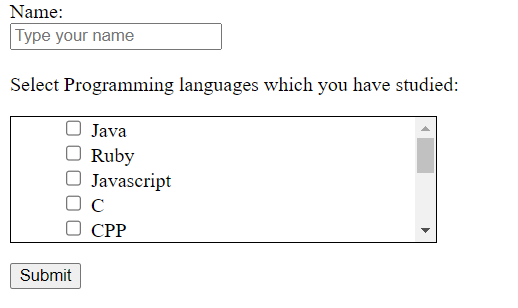

### What are fluid images?

- If we set the width and height of an image in percentage then the image will be adjusted to the browser window. If the image is adjusted to browser window through percentage then such images are termed as fluid images

# Links

Q. How to create empty link in link?

Ans. <b>href="#"</b> <span style="color:red;">Will not Work (X)</span>

To creat an empty link we use a javascript code as shown below:

`<a href = "javascript:void()">Empty Link</a>` (Test case passed)

To give a link which will actually navigate we use a following code:

`<a href = "javascript:void(location.href='')">Empty Link</a>`

Note:
Whenever we send the request, the browser will create an object called `HttpRequest` Object. The structure of HttpRequest is as follows:
<p>
    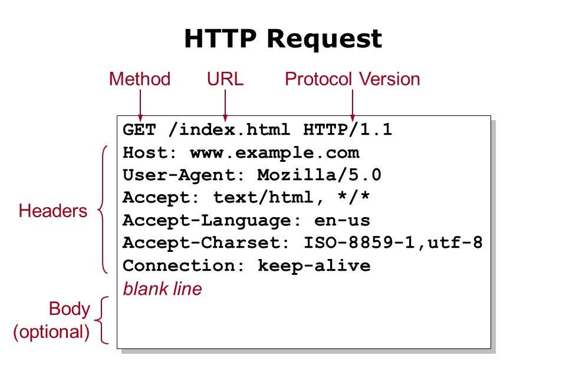
</p>

Link request is of "GET" method type

If the request is of get type then there would be no <u>request body</u> (Data will be sent to the server through URL)

Server will send the response by creating http response object. The class name in java will be "Response".
<p>
    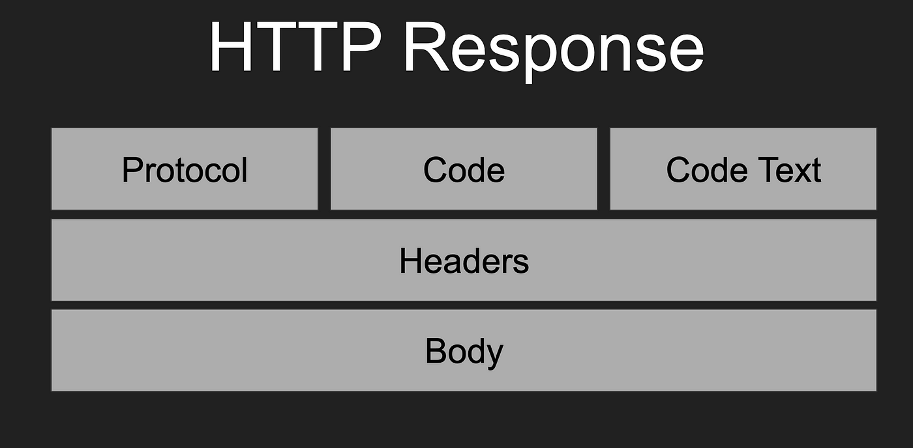
</p>

Status Number:

2XX Succesful
|Number| Msessage|
|------|--------|
|200|OK|
|201| Created|
|202| Accepted|
|203| Non-Authoritative|
|204| No content|
|205| Reset content|
|206| Partial content|
|207| Multi-status|
|208| Already reported|

1XX Informational
|Number| Msessage|
|------|--------|
|100|Conitnue|
|101| Switching Protocols|
|102| PRocessing|
|103| Easy hints|

4XX Client Eerror
|Number| Msessage|
|------|--------|
|400|Bad Request|
|401| Unauthorised|
|402| Payment required|
|403| Forbidden|
|404| Not Found|
|405| Method not allowed|
|406| Not Acceptable|
|407| Conflict|
|408| Payload too large|
|409| Too many requests|

5XX Server Error
|Number| Msessage|
|------|--------|
|500| Internet Seever Error|
|501| Not Implemented|
|502| Bad Gateway|
|503| Service Unavailable|
|504| Gateway Timeout|
|505| HTTP Version not supported|
|506| Variants also negotiates|
|507| Insufficient storage|
|508| Loop Detected|
|510| Not Extended|
|511| Network Authentication Required|

3XX Redirection

| Number | Msessage          |
| ------ | ----------------- |
| 300    | Moved Permanently |
| 301    | Found             |
| 302    | See other         |

Ex. 1: link ,

Note:

Normally links will be corrupted by the end user through a technique call URL rewriting.

## Inter Documentation Links

Q. 1. How to display the content of a link in new tab?

Using an attribute called `target = _blank`.

Ex. :

```
<a href="" target: _blank></a>
```

Q. 2. How to specify upon linking a file such that it can be downloaded?

```
<a href="file/path/filename.extension" download="nameOfFileToBeDownloaded"></a>
```

The file will be downloaded with the link name if download name is not specified. To download a file with user defined file name we use an option called `download="name"`

\*\*Q 3. How to open a linked document in new window?

```
<span></span>
<a href = "javascript:window.print()">Printer</a>

<a href = "javascrip:window.open('path/to/image', 'title', 'width = 300, height = 300')">
```

Q 4. How to open linked document in the same window align with other contents in a page?

Using HTML5 element called `<iframe>`

Syntax:

```
<iframe src="" name="></iframe>
```

In order to embed any videos, ppts, documents we always take the help of iframe element in a page.

In case of intra document if the page content is small and still if we want to give a navigation we use an element called `:target`

# Table element in HTML

- Tables are used to organize the data in rows and columns[Data present inside the table is Not the SEO friendly]
- Tables internally are presented with the help of "grid-component"
- Data in a table would be static whereas we give the effects of filtering, sorting throught backend technologies.
- In earlier versions of HTML tables were used to design layouts (Rows and columns).
- In HTML 5, we use tables only to present data in static manner with the help of elements as shown in below:

| Element     | Description                                           |
| ----------- | ----------------------------------------------------- |
| `<table>`   | It is a collection of rows and columns                |
| `<caption>` | It sets caption for table which makes it SEO friendly |
| `<thead>`   | It defines the table header section                   |
| `<tbody>`   | It defines the table body section                     |
| `<tfoot>`   | It defines the table footer section                   |
| `<th>`      | It defines column heading content[header cell]        |
| `<tr>`      | It defines the table row                              |
| `<td>`      | It defines the table cell content[ordinary cell]      |

### Attributes of table

- `frame` = box, void, above, below, lhs, rhs

void - it would not attache any border to the table.

This attribute is used to remove the outer border from the table.

- `border` : this attribute is used to set the border for entire table(for each cell and also it sets a frame for the entire table). The value of a border would be <b>0</b> or <b>1</b>. <b>1</b>

With respect to cell, if we increase the value of border to any number, there would be not any effect.

- `cellspacing` and `cellpadding` : It is a similar to margin and padding of css.

- `rules` : rows, columns, all, none

> If we use rules and border together, rules value would dominate

> whenever we use `rules` we should not work `border`, when we use `border` we should not use `rules`

- `background` and `bgcolor` :

`bgcolor` : It sets a background color for table, body, footer, cell , row
`background` : It sets background image for table. group, row, cell

```
<table background="./../../public/Image/Asia-Cup-2023.jpg">
<table bgcolor="red">
<tr bgcolor="red"></tr>
```

- `height` and `width` of table: height defines for row(affects whole row)

Syntax:

```
<tr height = "200"></tr>

<td height="100"> <!-- Not good -->
```

Width defines cell width (affects whole column).

```
<td width="200">
```

> Note : Always define height for "tr" and width for "td | th"

- In order to adjust the data within a cell, we use a attribute called `align`(Values: `left`, `center`, `right`, `justify`) and `valign`(Values: `top`, `bottom`, `center`). These attributes are applicable for a particular cell

- Merging of rows and columns :

> `colspan` - It can merge specified number of columns into single column
> `rowspan` - It can merge specified number of row into single row

Note : `colspan` and `rowspan` can be applied only "`<td>` | `<th>`"

# Analogy of class in java and elements in HTML

<p>
    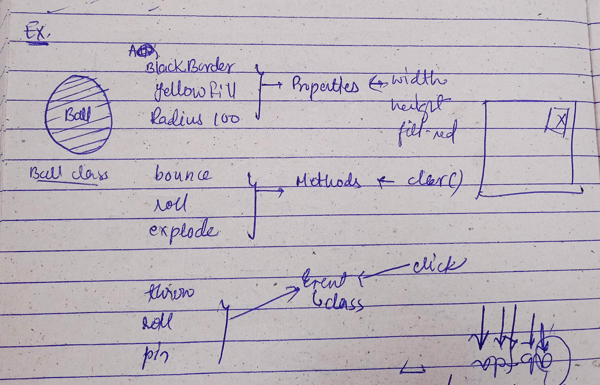
</p>
<p>
    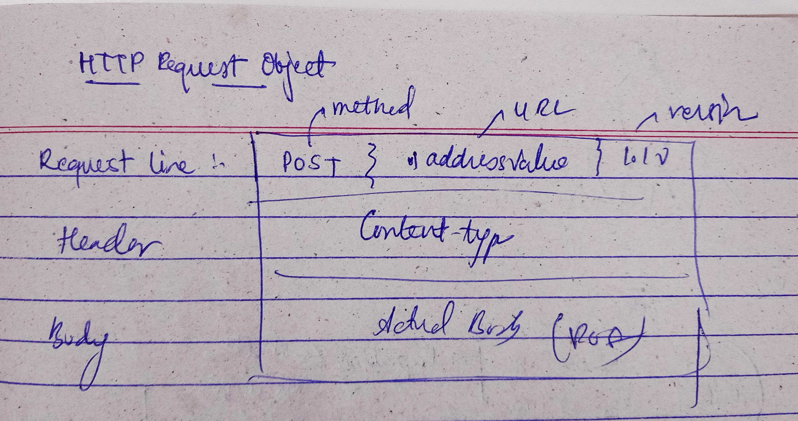
</p>
<p>
    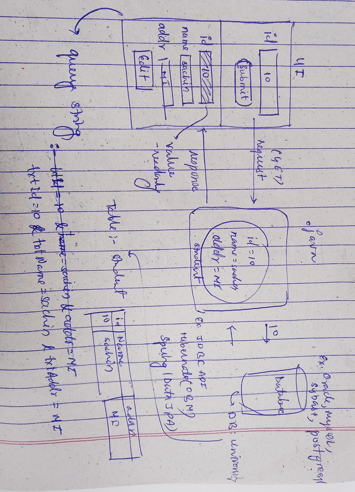
</p>


# Form

- Form provides an UI from where user can interact with our application.
- Interaction includes insert, delete, update, query etc. [CRUD/ CURD/ SCUD]
- Forn is a generic container which have <u>default functionality</u>
- A form can submit and reset its data without configuring any explicit functionality.

## Form container

- It is designed by using `<form>` tag

Syntax:

```
<form>
    form-elements
</form>
```

> NOTE: In a page we can submit the details only when they are enclosed in a form.

Syntax:

```
Name: <input type="text" name="Name"> // Not good
```

```
<form>
Name: <input type="text" name="Name"> // good
</form>
```

### Form Attrubutes:

1.id, 2. class, 2. name (Required for identification purpose for css)

4. Method:

It indicates how the data should be submitted to the server. The values of method are : "GET" or "POST".

a. The default method type is "get".(<b>select</b> query will run based on input)

b. If we want to send large volume of the datato the server, then we go for "post" method type. (<b>insert</b> query will run for the input provided by the use)

## The other values of methods are

1. PUT(update clause is used)
2. PATCH(update clause is used)
3. DELETE (Delete clause)
4. TRACE
5. OPTION

- Big 7 HTTP methods

- To send the request of type put, patch, delete - we use a softwares like CURL, POSTMAN, OPENAPI.

- DIfference between GET vs POST

| Sr No | GET                                                                                                                      | POST                                                                 |
| ----- | ------------------------------------------------------------------------------------------------------------------------ | -------------------------------------------------------------------- |
| 1     | It supports caching(saves round trip)                                                                                    | It does not supports caching                                         |
| 2     | Upon submitting the data, query string will be constructed and it will be attached to URL                                | Query string will be constructed and it will not be attached to URL. |
| 3     | Small volume of data would be allowed(2048 character)                                                                    | No limit on submitting the data(any volume).                         |
| 4     | You can't submit the complex data like audio files, video files, image files(Binary data - it supports only ascii types) | We can submit the complex data.                                      |
| 5.    | It is not safe so the data can be hacked                                                                                 | The data is safe and can't be hacked easily                          |

What is query string?

> It is a string which is constructed by web browser upon the user entering the details and clicking on submit button. Query string data would be in the form of key-value pair.
> 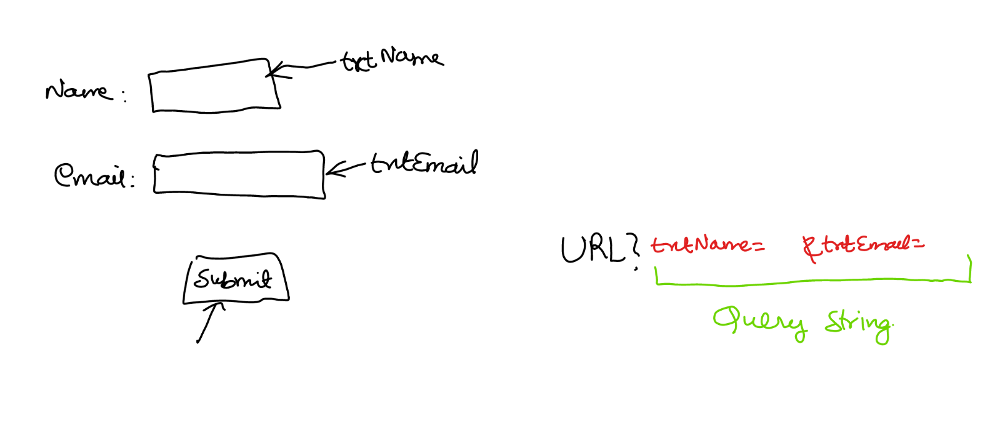 > 

<!-- <></div> -->

````
logicalName1=value & logicalName2=value2 & ......
```w

2. Action-attribute:

This attribute value would be location of a program where the data has to be sent

````

<form method="post" action="http://localhost:9999/FirstProject-01/first">
```

> doGet(requestObject, responseObject) - for get method <br>
> doPost(requestObject, responseObject) - for post method

3. novalidate

This attribute is used to verify whether the user entered data should it be validated or not. If we use novalidate attribute then the inpu entered by the user would not be validated(email, number).

## Elements of Form

1. `<input>` -[HTML4]
1. `<textarea>` -[HTML4]
1. `<select>` -[HTML4]
1. `<progress>` -[HTML5]
1. `<meter>` -[HTML5]

#### Attributes of input element: 1 . type = "text"

1. `type="text"` : User can enter any character type of data
2. `placeholder=""` : It is normally used to keep a watermark content of a particular element.
3. `value` and `readonly` and `disabled` : Values is the attribute which allows us to populate the by default value in text box.

If we use `readonly` attribute, then we can't edit that text field and the data will go in query string.

If we use `disabled` attribute, then we can't edit that text field and the data will not go in query string.

`readonly` would permit the submitting the data to the backend whereas `disabled` would not permit submitting the data to backend.

4. `required` : It indicates the value should be compulsorily entered by the user otherwise the page wouuld not be submitted.

5. `size` : It adjusts the width of the text box. (default width is 20).
6. `minlength`: It indicates minimum number of characters to be entered by the user. (Validation)
7. `maxlength`: It indicates maximum number of characters entered by the user (Once it reaches the max limit user can't enter any data in the container).

8. `autofocus` : This attribute is used to focus on a particular element when the page gets loaded. Throught javascript we can use this attribute to make it dynammic to identify the error elements(validation failed elements) in the webpage.

9. `list` : It uses a datalist that contains an options to display as autocomplete text.
   Datalist is designed using an element called `<datalist>`, to design a set of options for a `<datalist>` we use an element called option

10. `pattern`: With respect to this attribute we use a regular expression. Regular expression comprises of metacharacters and quantifiers.

| Metacharacters | Qunatifiers |
| -------------- | ----------- |
| ?              | {}          |
| +              | {m, n}      |
| \*             | {m, }       |
| \|             |             |
| .              |             |
| [ ]            |             |
| ( )            |             |
| <b> \ </b>     |             |
| ^              |             |
| \\^            |             |
| $              |             |


| Metacharacters | Description |
| ---------------| ------------|
| ? : occurence 0 or 1 | It defines zero or one occurence of a character. <br>Ex.: `<input patter="colou?r" placeholder="color/colour" type="text" name="txtColor">`.<br> Accepted values: color/colour |
| \* : occurence >= 0  | It defines zero or more occurennce of a character.<br>Ex.: `<input pattern="colou*r" placeholder="color/colour" type="text" name="txtColor">`<br> Accepted values: color/colouuur/colouuuuuuuuur. <br> Not accepted values : <b style="color:red;">colorrr/ colooor</b>                                                          |
| +: occurence >= 1    | It defines one or more occurennce of a character.<br>Ex.: ` <input pattern="colou+r" placeholder="color/colour" type="text" name="txtColor">`<br> Accepted values: colour/colouuur/colouuuuuuuuur. <br> Not accepted values : <b style="color:red;">color/ colooouur</b>                                                         |
| <b>.</b> (dot)       | It stnads for replacing exactly one character and that character can be (uppercase, lowecase, digits, special symbols). <br> Ex.:`<input pattern=".o." placeholder="color/colour" type="text" name="txtColor">` [boy, #o?, ioi]<br>`<input pattern=".y" placeholder="color/colour" type="text" name="txtColor">`[by, hy, .y, @y] |
| \\                   | It is used as escape sequence character for special characters[Char used by parser] <br>\\+91=+91                                                                                                                                                                                                                                |
| \|                   | It is used to club multiple expression to find a unique result<br>Ex.:<input type="text" name="txtColor" placeholder="red, green or blue" pattern="red                                                                                                                                                                           | blue | green">` |
| [ ] (important)      | It represents a range of characters which can be accepted as an input from the user.<br> Ex.: `[a-zA-Z0-9]` <br>`[a, d, s]` <br>`[a-z, A-Z]` <br>`[0-9]` <br>`[a-d, 4-9]`                                                                                                                                                        |
| ^                    | Exclude specified<br>`pattern="[a, d, s]"`: a,d,s are allowed<br>`pattern="[^a, d, s]"`: except a, d, s all will work                                                                                                                                                                                                            |
| \\^, $               | Matcehs the beginnig of input, "starts with".<br> Matches the end of input, "Ends with".<br> `pattern="\^..your_expression$"` <br> Ex.: `pattern="\\^\[a-zA-Z]@\.[a-zA-Z0-9]$"` (a@.3)                                                                                                                                           |
| \\d                  | It allows only numeric value, any single digi [0-9]. <br> Ex: `<input type="text" name="ex" pattern="\d\d">` (only 2 digits number) <br> Ex.: `<input type="text" name="ex" pattern="\d?d">`                                                                                                                                     |
| \\D                  | Not a digit [^0-9] or \\D only non-digit                                                                                                                                                                                                                                                                                         |
| \\w                  | Matches alpha numerical[word] characters with underscore. == [a-zA-Z0-9_] <br>` <input type="text" name="ex" pattern="\w\w">`                                                                                                                                                                                                    |
| \\W                  | Matches any character is not a word character. == [^a-zA-Z0-9_] <br>Ex.:`<input type="text" name="ex" pattern="\W">`                                                                                                                                                                                                             |
| \\i                  | ignore capitalizatoin of whole data. <br>                                                                                                                                                                                                                                                                                        |
| \\s                  | Match a single white space character. Including space, tab, form feed, line feed and other unicode characters. <br> Ex.: \\n: Line Feed <br> \f : Form feed <br> \t : Horizontal tab <br> \v : vertical Tab                                                                                                                      |

### Quantifiers

| Qunatifiers | Meaning                                                           |
| ----------- | ----------------------------------------------------------------- |
| {n}         | Exactly specified number of characters, n - Refers to the number. |
| {n,m}       | Minimum -n and maximum-m. Ex: {4,10} - 4 to 10                    |
| {n,}        | Miniumu-n and Maximum-any. Ex. : {4, } 4 to infinity              |

Ex.: `<input type="text" name="ex" pattern="[a-zA-Z]{5,6}@[a-zA-Z]{5}\.[a-zA-Z]{2,}">`

Note:

Metacharacters indicate what characters needs to be allowed. Whereas quantifiers indicates how many times it has to be allowed.

Regular Expressions[Pre-defined]:

1. `(?=.*[A-Z])` : Atleast one upper case letter at any place.
1. `(?=.*[a-z])` : Atleast one lower case letter at any place.
1. `(?=.*[0-9])` : Atleast one numeric at any place.
1. `(?=.*[!&@#%])` : Atleast one special character at any place.

### summary of attributes of input:

| `<input>`   |                                                        |
| ----------- | ------------------------------------------------------ |
|             | name, id, class                                        |
|             | size                                                   |
|             | placeholder                                            |
|             | autofocus                                              |
|             | value                                                  |
| <b>text<b/> | readonly                                               |
|             | disabled                                               |
|             | required: validation                                   |
|             | minlength: validation                                  |
|             | maxlength: not able to enter if data exceeds maxlength |
|             | list: autosuggestion                                   |
|             | pattern: validation using regEx                        |

### 2. `type = password`

- Value entered by the use will be masked by star symbol

### 3. `type="number"`

- To enter the only number type we use attribute value `type="number"`

`<input type="number" name="txtNumber" min="18" max="58" step=5>`

### 4. `type="range"`

`<input type="range" name="txtLoan" min="50000" max="400000">`

- The value chosen through the slider option can be displayed on the page only through "javascript".

### 5. `type="email"`

- It just checks for "@", but will not worry about extension like (.com, .livem .ai, ... )

### 6. `type="url"`

- It validates URL format
- If you want the user to input websire address(URL) abd restrict to URL format then you can define `type="url"`
- URL Format should contain "protocol and domain"

#### Syntax:

Ex.:
`<input type="url" name="txtUrl" size="50">`

www.amazon.com :-> Invalid

### 7. `type="color"`

- To give a color type of input we go for `type="color"`
- color inputs in html can be provided in 3 ways:

  1. name : red, green, yellow, blue
  2. lightcolors or color shade name: Darkcyan, lightcyan
  3. Hexadecimal code:

     - Hexadecimal color can be defined in 3 or 6 chars followed by hash (#)

       1. 3 chars Code : #RGB
       2. 6 chars code: #RRGGBB

  4. Red, Green and Blue value can be "0" to "F"

     Hexa - 0, 1, 2, 3, 4, 5, 6, 7, 8, 9, a, b, c, d, e, f
     [0 is minimum, f is maximum]

     0 - Dark, f - Bright

### 8. `type="date"`

- HTML allows to input datae value by using the "type=date"
- It is not supported on all browser, hence we have to implement using jQuery.
- datetime value is removed from 'html5 major version'

1. date
2. datetime-local
3. month
4. week
5. time

How to restrict the user for date selection?

> Using `min` and `max` attribute

Note: always the date input format must be "year-month-day"( "YYYY-MM-DD") - (mysql) || "day-month-year" (DD-MM-YYYY).

we cam't select range of dates using html, for that we have to go for jQuery/javascript.
eg. :

```
Departure Date:
        <input type="date" name="txtDate" min="2024-09-02" max="2024-10-02">
        <button>Submit</button>
```

### 9. `type="file"`

- In order to accept file as the input from user we go for the type="file".
- attribute:

  1. multiple : to accept the multiple files
  2. accept=".png, .jpg, .jpeg" : To accept the only specified file format

### 10. radio button[grouped] and checkbox

- Radio button are referred as group button(mutex nature would be imposed on those elements by giving <u>common names</u>)

Note : Mutex referes to <b>mutual exclusion</b>.

Mutual exclusion is a threading terminology where one thread will execute only one task at any given point of time.

Ex.:

```
<p>What's your favourite langauge?</p>

<input type="radio" name="lang" value="Java"> Java
<input type="radio" name="lang" value="Python" checked> Python
<input type="radio" name="lang" value="cpp"> C++

<br>
<p>Please select gender? </p>

<input type="radio" name="gender" value="male"> male
<input type="radio" name="gender" value="female"> female

<br>
```

CheckBox:

- Checkbox allow user to select and deselect any option
- You can use checkbox for selecting one or multiple options from a group of choices
- The attributes ate same as radion buttons
    - id
    - name
    - class
    - value
    - checked ... etc
- it is defined by `type="checkbox"`
#### FAQ 1. When should we use radio button element in a webpage?

> If we want to user to compulsorily select one option among the supplied inputs we go for radio buttons .<br>
> To make it default selected we use an attribute called
> <u>"checked"</u>


#### FAQ 2. How to create a checkbox list in HTML?

```
<form action="">
        Name: <br>
        <input type="text" name="txtName" placeholder="Type your name"> <br> <br>

        Select Programming languages which you have studied: <br>   

        <ul>
            <li>
                <input type="checkbox" name="chk" > <label for="chk">Java</label>
            </li>
            
                <li><input type="checkbox" name="chk" > <label for="chk">Ruby</label></li>
                <li><input type="checkbox" name="chk" > <label for="chk">Javascript</label></li>
                <li><input type="checkbox" name="chk" > <label for="chk">C</label></li>
                <li><input type="checkbox" name="chk" > <label for="chk">CPP</label></li>
                <li><input type="checkbox" name="chk" > <label for="chk">Ruby</label></li>
                <li><input type="checkbox" name="chk" > <label for="chk">R</label></li>
                <li><input type="checkbox" name="chk" > <label for="chk">Bash</label></li>
                <li><input type="checkbox" name="chk" > <label for="chk">SQL</label></li>
                <li><input type="checkbox" name="chk" > <label for="chk">DAX</label></li>
                <li><input type="checkbox" name="chk" > <label for="chk">Scala</label></li>
            <li>
                <input type="checkbox" name="chk" > <label for="chk">Python</label>
            </li>
        </ul>

        <button>Submit</button>
    </form>
```

<p align=center>
     
</p>


Dropdown list:
- it allows the user to select any one option from a group of choices.
- It shows the list of items using a dropdown menu.
- HTML provides the following elements for designing dropdown list:
    - `<select>` : It is used to configure a list
    - `<option>` : It is used to configure a list item
    - `<optgroup>` : It is used to grp a set of options into one category

- Every `<option>` comprises of following attributes
    - value : It defines the value to be submitted
    - selected : It defines the value to be selected (not checked here)
    - disabled : To make it disabled we use this option

NOTE: In one line it is presenting more elements information

ListBox:
- Everything is same as dropdown list in elements and attribute
- It allows to select one or multiple 
- To change the dropdown into listbox you have the attribute "size or multiple"

Note : The options in dropdown or listbox are RC data type. They allow only plain text number and special chars.
        You can't add icon/.gif or images we need to use bootstrap and css
        We can't create nested drop downs using HTML(using bootstrap and css) 


### 11. `textarea` element

- It is used to handle multiline input
- It is RC data element used to present plain text.
- It is similar to textbox but allows to write multiple lines
- Attributes are similar to text input, additional used:
    - rows : It represents height.
    - cols : It represents width.
    - readonly : It will not alllow to modify text but we can submit.
    - disabled: It will not allow to modify and submit.


### 12. `button` element

|Generic Button| Non-generic button|
|--------------|-------------------|
|HTML5: <br>`<button>TEXT,IMAGE,SYMBOLS</button>` <br> `<button type="submit">TEXT,IMAGE,SYMBOLS</button>` <br> `<button type="reset">TEXT,IMAGE,SYMBOLS</button>`| HTML5:<br>`<button onclick="window.print()" type="button">Print Page</button>`|
|HTML4:<br>`<input type="submit">Submit</input>`<br>`<input type="reset">ClearForm</input>` |HTML4:<br> `<input type="button"></input>`|


### 13. `meter` element

- It can be used to display the grade meter
- It can display a value range with
    - min
    - max
    - low
    - high
    - optimum
    - value
- It can be controlled by javascript


### 14. `progress` element

- It is used to show the status of any task performed in the page.
- The task includes action like
    - copying 
    - Downloading
    - uploading
    - connecting
- It is used to display the time elapsed or the remaining to complete the task
- Specially progress is used in pages that use "Ajax"[Asynchronous JavaScript and XML]
- Attributes used for progress
    - min
    - max
    - value


### 15. `label` element

- `label` it is an element which is used to describe the information about what input the user should give (information to the user)
- `label` element is also used to bind with fields(dynamically linked through javascript).
- To bind with any field it uses an attribute called "`for`"
- Binding is required to manipulate the field dynamically 


# Library
- It referes to the set of readymade methods available for the user to use in the application development.
<p>
    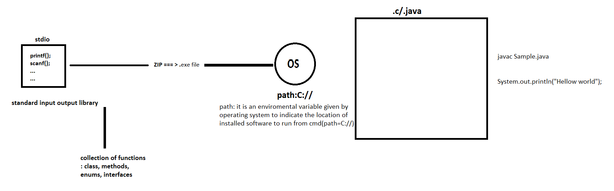
</p>

## Installing a library

1. Thorugh package manager (it would be downloaded and installed directly on the project folder ) locally

2. Through server - HTML

<p>
    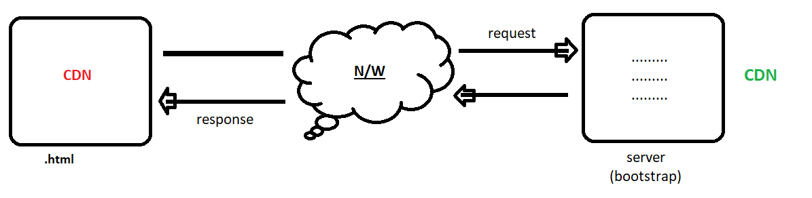
</p>

3. Through server - JAVA

<p>
    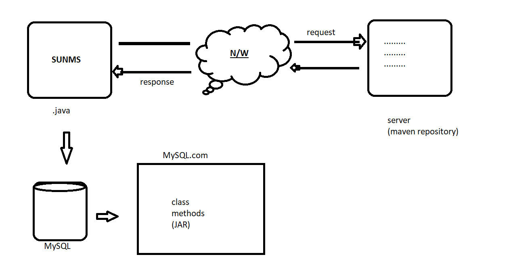
</p>


##  Building form using bootstrap classes.

### 1. Container classes

- .container [For smart watches]
- .continer-ss (small) [for mobiles]
- .continer-md (medium) [for mobiles]
- .container-lg [for PC]
- .container-xl [for laptop]
- .container-xxl [for laptop wide screen]
- .container-fluid [for responsive [fit according to device]]


### 2. Margins 
- .m-{size} : margin in all directions
- .ms-{size} : left margin {s = start}
- .me-{size} : right margin {e = end}
- .mt-{size} : top margin {t = top}
- .mb-{size} : bottom margin {b = bottom}

size : 1 to 5

eg. : `<form class="ms-5">` , `<h2 class="ms-4">Bootstrap</h2>`

### 3. Padding
- .p-{size} : padding in all directions
- .ps-{size} : left padding 
- .pe-{size} : right padding 
- .pt-{size} : top padding 
- .pb-{size} : bottom padding 
        size : 1 to 5

### 4. Border
- .border : to give border
- .border-{size} : {1 to 5}
- .border-{contextual} : warning dange success info primary seconday

### 5. rounded
- .rounded
- .rounded-{size} : [1 to 5]
- .rounded-circle
- .rounded-pill : [requires more width]

### 6. widht and height

- .w-{size} : 25, 5, 75, 100
- .h-{size} : 25, 5, 75, 100


### 7. display

- .d-none
- .d-block
- .d-inline
- .d-flex
- .d-flex-wrap 
- .d-flex-nowrap 
- .justify-content-{center, left, between, space-around....}
- .align-items-{center, end, start ,top , baseline}

### 8. Bootstrap grid
- .row 
- .col : responsive
- .col-{size} : 1 to 12


### 9. Bootstrap inbuilt classes for form elements

- 


### Button  classes  : 
1. .btn
1. .btn-{contextual}
1. .btn-outline-{contextual}
1. .btn-sm
1. .btn-lg
1. .btn-group
1. .btn-group-vertical
1. .btn-close
1. .btn-link
1. .btn-toolbar
 

### INPUT GROUP CLASSES:
------------------------
- .input-group
- .input-group-text

syntax : 
```
    <div class="input-group">
        <span class="input-group-text">&#8377;</span>
        <input type="text">
        <span class="input-group-text">.00</span>
    </div>
```


### CSS Classes for validating the elements


1. :required -> It configures when the field is defined with required
2. :optional -> If configures when the field is not defined with required.

<p align=center>
    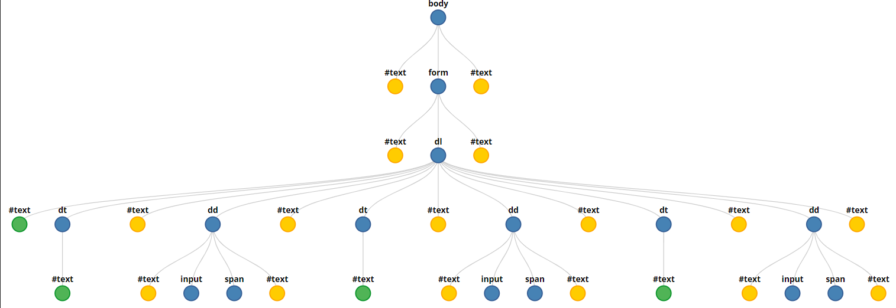
</p>


3. :valid -> It defines effects when all validations attributes are satisfied.

4. :invalid -> It defines effects when the field validation return error.


## Multimedia with HTML

1. `<marquee>`
2. `<audio>`
3. `<vidoe>`
4. `<embed>` [HTML4 - Deprecated]


1. marquee

|Attribute| Description|
|--|--|
|Scroll amount| Control the marquee scrolling speed[1 to 100]|
|direction| It specifies the scrolling directions, which can be left, right, up or down| 
|width and height| Sets the widht and height of the content| 
|loop| specifies the number of time marquee content need to display| 
|bgcolor|It sets the background area|

2. video and audio element

|Attribute| Description|
|--|--|
|autoplay | It uses "boolean" value [true/false].|
|controls| It is used to define the controls for media player.| 
|mute| it uses boolean value to mute the video on loading| 
|loop| it allows us to loop the video| 
|poster | it is used as thumbnail for video before playback|


----------------------------------------------
<hr>

# CSS

- Styles refers to providing an extra attribute through which the apperance can be change to get good look and feel.
- In case of styling language we go for a mime type called text/css.


- we can link css to HTML in three ways :
1. Inline
2. Embed 
3. External


## 1. Inline 
```
<element style="attribute2: value; attribute1: value;......."></element>
```

- Applying the stylen with respect to inline is faster as it is local to that particular element.
- It is best suited only, when we want to use that style for that particular element.
### Limitation :

1. Increase in redundancy as the scope is limited to that line, we need to rewrite the instruction again to get the effect for another element. 


## 2. embed

```
<style type=text/css>
    x {
        ....
        ....
    }
</style>
``` 
1. If the `<style>` element is placed inside head element.Then the code would be loaded to browser memory and it would be used at the later stage as per our requirement.
Ex. :
```
<head>
    <style>
        h1 {
            background-color: red;
            text-align: center;
        }
    </style>  
</head>    // browser memory

<body>
    <h1>Hii</h1>
</body>
```


2. Inside the body element. : If we keep the style element inside the body at the time of the rendering the element style effect would be applied by the browser.

3. Outside HTML element. : Same as case 2, but it will behave in abnormal ways in some scenarios.

