# Client Server Architecture

1. Client is a computer which is capable of sending request to other computers present in interenet.
2. We say client as a computer but in reality browser software is termed as a client.

# Server

1. It is a computer which has a capability to provide output to any number of clients.
2. Normally a server computer would be referred as high configuration computer.
3. Inside the server computer we install a server software called "web-server" (Ex's., Tomcat, glassfish, wildfly, Jboss)

Installing nodejs will promote a build tool through which we can automate the process of taking third party libraries from different websites to our project with the help of a command called "npm"

Q. What is a website, internet, web?

# HTML Parsing

On a browser to display the content. Our requirement we need to markup our content.

To markup the content on a browser, we need language called HTML.

# Evolution of HTML

1. GML - It stnads for Generic Markup Langauge
2. SGML - It stands for Standard Generic Markup Langauge, it is add on to the GML.
3. Tim Berner Lee introduced a new markup language called as HTML which is a subset of SGML.
4. Initially HTML was a open-source langauge.
5. HTML was introduced as a communicating langauge to web by Tim Berner Lee.
6. HTML is maintained by a community called "WhatWG"
7. HTML-4 version didn't gave importance for SEO and responsive design.
8. In HTML-5 different <u>semantics</u>(elements) to give importance for SEO and resposive designs.

- NOTE: SEO refers to Search Engine Optimisation

8. Whenever we type some content on a browser which needs to be searched on google search engine uses SEO technique(Robos like bot, web crawlers, web spider,... etc)

### Categories of HTML elements

1. Normal Elements - `<b>`
2. Void Elements - ``

3. RC(Rich Context) Data Elements

    Ex.:

    ```
        <textarea>
            <p>Hello pw'ian</p>
        </textarea>
    ```

Ouptut:


4. Raw Text Element

Ex.:

```
Temperature25C 4500/-
```

```
Temperature25&deg;C &#8377;4500/-
```


5. Foreign Elements - ex. svg, mathml

## Structure of HTML

Arranging the elements of HTML in a hierarchial way to a present on a webpage is called "DOM"(Document Object Model).

Skeletal Structre:

```
<html>
    <!-- Document scope -->
    <head>
    </head>

    <body>
    </body>
</html>
```

The content presented in head section is mainly used for SEO and responsive design.

The elements which can be written inside `<head>` section are:

1. `<title>`
2. `<link>`
3. `<meta>`
4. `<style>`
5. `<script>`

- `<!DOCTYPE html>` - It is indication to browser engine that in the body section we use elements of html-5.
- `<html lang = "en-IN">` - It is indication to browser engine that the output should be feasible to the end-user in a particular format.

## Body Section(Dynamic content)

- Attributes of body tag:

1. bgcolor - this attribute is used to set the background color for the body section
2. text - this attribute is used to set a different color valuefor the content to be presented on a webpage.

Ex.: `<body bgcolor = "black" text = "white"> </body>`

- To control the elements of a webpage after the presentation we go for CSS(Styling language)

CSS attributes for background:

1. background-repeat : repeat| non-repeat| repeat-x| repeat-y
2. background-size : contain| cover| auto |width&height in pixels
3. background-position : top| center| right| left
4. background-attachment : fixed | scroll

### HTML5 new semantics(Elements)

1. Header
2. Section
3. Nav
4. Main(Entry point)
5. Article
6. Figure
7. FigCaption
8. Dialog
9. Aside
10. Footer
11. Div
12. Span

## Div v/s Span

The `<span>` tag is myuch like the `<div>` element, but `<div>` is a bloack-level element and `<span>` is an inline element.

Padding is used to create space around an element's content, Inside

1. To align the content in column wise in css we use have an option called `display: flex;`
2. We can control the attributes of font through css using

   - `font-family:`, `font-style:`, `font-size:`, `font-weight:`,

3. For a span element width property can't be applied directly (no effect). To see the effect we use attribute called `display: inline-block;`

- Default screen width is 1200px, so max no. of columns in a page is 12.

### Different Types of css selector

1. Selecting child and sibling in css

   :

   parent child { ==> Child Selector

   }

   ElementA + ElementB { => Adjacent Building

   }

   ElementA ~ ElementB { => All elements after specific

   }

- For any image to be blurred and if the content has to be presented on a blurred image we go for an attribute called `background-color: rgba();`, "a" stands for alpha and range of alpha is 0 to 1.
- To display any content to the center (Horizontal and Vertical):

  1. Keep all the the content in one contaier
  2.

  ```
  <body>
      <div>
          // Your content here
      </div>
  </body>
  ```

  3. Body is the container here which would display the contents center with attributes

  ```
  body {
      display: flex;
      justify-content: center;
      align-items: center;
      height: 100vh;
  }
  ```

  Note:

  - justify-content

- Figcaption element is used by searche engine to load the image as a search result for the end user.

```
<figure>
        <div>
            <!-- PLACE IMAGE -->
        </div>

        <figcaption>
            Browser Image
        </figcaption>
    </figure>
```

- Element designed for coding platforms

  1. `<code></code>` - To indicate the presentation content is for programming
  2. `<var></var>` - To indicate the browser engine that it is a variable
  3. `<samp></samp>` - To indicate the description about program we use `</samp>` element.

- What is difference b/w `<br>` and `<br/>`?

1. There is not such element called "`<br>`" in HTML.

- `<pre>` - It is used to preserve the whitespaces in particular container

- `&nbsp;` - It is used to mark the spaces set by the user for any element

#### Small Text and Big Text

- `<small>content</small>` :: It sets letter size smaller
- `<big>content</big>` :: It sets letter size large

#### Details and summary

Syntax:

```
<details>
    <summary>content</summary>
</details>
```

#### Details and summary

- It is used to display the content in detail only when required.
- It allows to expand and collapse your content.
- It saves the screen space

## Data List with Terms and definitions:

```
<dl>
    <dt>Term</dt>
    <dd>Definition</dd>
    <dt>Term</dt>
    <dd>Definition</dd>
    <dd>Definition</dD>
</dl>
```

Note:

- `<dt>` and `<dd>` will have some default alignment, so it is easy for presentation.
- `<dl>` has the capability to display in columns using grid (`<dt>` -> one column an `<dd>` -> one column)

Note:

```
dt {
     position: sticky;
     top: 0;
}
```

NOte:
In Css we can set shadow to any container by using box-shadow attribute.

- Box shadow will have 4 values

```
{
    box-shadow: horizontal vertical blur color;
}
```

## Heading elements in HTML

- Heading elements are mainly used to define headings and to describe a <u>topic</u> in a webpage
- Heading element default behaviour is:

  1. Display -> block
  2. font-weight -> Bold
  3. font-size -> vary according to hn : 1 to 6 -> the size will decrease

Q. 3 Can we change the apperance of `<hn>` tags?

Ans :

> Through css we can change the default behaviour.

```
h1 {
    font-size: 50px;
    font-weight: lighter;
    color: blue;
}
```

Q. 4 Can we remove the default style defined for heading?

Ans:

> Yes it can be made possible with the help of css Inheritence.

```
h1 {
    text-align: center;
    display: unset;
    font-size: unset;
    font-weight: unset;
}

h2 {
    all: unset;
}
```

## Working with paragraphs

1. `<p></p>` - To present the content in the form of paragraph we use `<p>` element.

- It supports "align" attribute, which can set text left, center, right or justified.
- paragraphs will have a line break before and after.

2. `<blockquote></blockquote> ` - It is used to present summary of content in. By default the behaviour would have left right indentation and some margin bvalue for blockquote.

Q. How to set the first-line indent for paragraph or blockquote?
using css attribute `text-indent: __px`

Q. how to set line space, word space, character space in a paragraph

Using CSS attributes `line-height:, word-spacing:, letter-spacing:`.

Ex.:

```
blockquote {
    text-indent: 50px;
    line-height: 30px;
    word-spacing: 7px;
    letter-spacing: 3px;
}
```

Q. How to set dropcap?

- By using the following style we can set dropcap:

  - Access the first letter using the class : first-letter
  - After accessing the firstletter apply fonts[size, weight, family]
  - Apply css float

- Difference between display: grid; vs column: ; of a css attribute

  1. display: grid; would display the content column wise in the given frame width(column ratio).
  2. columns:; this attribute take number of columns as the input and display the content in continuous

## Text Formatting In HTML

- We can change the text formatting using font
  font: we can change the face (family), size and color.

face - font family

color - It represents color name and color code

size - 1 to 7 (increasing order)

```
<font face = " " size = "" color = ""> Your Text </font>
```

- HTML attribute for style

  | Tag            | Design Team | Review Team | Output            |
  | -------------- | ----------- | ----------- | ----------------- |
  | Bold           | `<b>`       | `<strong>`  | <b>Bold</b>       |
  | Italic         | `<i>`       | `<em>`      | <i>Italic</i>     |
  | Underline      | `<u>`       | `<ins>`     | <u>Underline</u>  |
  | To strike down | `<strike>`  | `<del>`     | <del>Strike</del> |

- What are web safe fonts:

> These fonts are such fonts which would be available in every machine and it can't be deleted .

Ex: sans-serif, mono space, serriff

## Ordered And undorderd List

- Order list will add auto numbering for a list of option, which can update automatically when your add or delete items.
- Orders list is defined by using `<ol>` element
- Itemns in list are defined by using `<il>`

Syntax:

```
<ol>
    <li>Itme-1</li>
    <li>Itme-2</li>
<ol>
```

Note : Default numbering will be given for items

`type` : It specified the numbering type, which can be: a, A, i, I, 1(default)

`start`[number] - It defines the numbering level to start with.

## Nesting in list elements

Bad Code

```
<ol>
    <li>Front End</li>
        <ol type = "a">
            <li>HTML</li>
            <li>CSS</li>
        </ol>

    <li>Back End</li>
        <ol type = "a">
            <li>Node JS</li>
            <li>MongoDB</li>
        </ol>

</ol>
```


Good Code

```
<ol>
    <li>Front End
        <ol type = "a">
            <li>HTML</li>
            <li>CSS</li>
        </ol>
    </li>

    <li>Back End
        <ol type = "a">
            <li>Node JS</li>
            <li>MongoDB</li>
        </ol>
    </li>

</ol>
```


Questions:

1. How to remove numbering in orderlist?

   Ans

   > It is possible to remove numbering of ordered list element throught a css attribute called `list-style: none;`

2. How to create scrollable list?
   Ans

   > Keep a Border, Keep a proper width and height as per the content area. Using an css attribute `overflow: hidden | scroll | auto`.

3. How to display list items inline?
4. How to display li in columnss wise?

   i.

```
ol {
    display : grid;
    grid-template-columns: 6fr 6fr;
}
```

```
ol {
    columns: 2;
}
```

5. How to change the options in ordered list?

## Unordered List

Syntax:

```
<ul type = "square">
    <li>Web Server</li>
    <li>Web Site</li>
    <li>Web Page</li>
</ul>
```

How to set up custom bullets?

Ans: We can do by using `list-style-image:;` attribute of css.

## Pagination

-- It refers to the process of displaying the records by splitting them into <u>pages</u>.

```
<ul>
    <li><span>&laquo;</span></li>
    <li><span>1</span></li>
    <li><span>2</span></li>
    <li><span>3</span></li>
    <li><span>4</span></li>
    <li><span>5</span></li>
    <li><span>....</span></li>
    <li><span&raquo;</span></li>
</ul>
```

We can use only those images from google which are filtered using : Creative common licenses. So that our website we don't get copyright.

from -> tools

> Different types of images:

| Sr Number | Abbreviation | FileFormat                         | MIMEType      | FileExtension                   |
| --------- | ------------ | ---------------------------------- | ------------- | ------------------------------- |
| 1.        | APNG         | Animated Portable Network Graphics | image/png     | .apng                           |
| 2.        | BMP          | Bitmap File                        | image/bmp     | .bmp                            |
| 3.        | GIF          | Graphics Interchange Formage       | image/gif     | .gif                            |
| 4.        | ICO          | Microsoft Icon                     | image/x-icon  | .ico, .cur                      |
| 5.        | JPEG         | Joint Phototgraphic Expert Group   | image/jpeg    | .jpg. jpeg, .jtif, .pjpeg, .pjp |
| 6.        | PNG          | Portable Network Graphics          | image/png     | .png                            |
| 7.        | SVG          | Scalar Vector Graphics             | image/svg+xml | .svg                            |
| 8.        | TIFF         | Tagged Image File Format           | image/tiff    | .tiff, .tif                     |
| 9.        | WEBP         | Web Picture Format                 | image/webp    | .webp                           |

Q. What is MIME Type ?

- MIME stands for "Multipurpose Internet Mail Extension"

- Server upon sending the information to the browser, it will also send what type of information is being send.

- To inform the type of information we go for MIME Type.

Purpose of different types of images:

| Type | Purpose                                                                            |
| ---- | ---------------------------------------------------------------------------------- |
| PNG  | High resolution(More space), Suitable for downloads                                |
| JPG  | Compressed Image Format(Less Space) , Good for on screen presentation              |
| GIF  | Low Resolution, used for animations                                                |
| SVG  | Ex. : 1. Google Map, 2. Bootstrap Icons, not pixel based, high zoom quality        |
| WEBP | If we try to save an image it saves the entire page. Image alone can't be captured |

Embedding an image in webpage:

- It is a void element
- `` is configure with following attributes
  ``

Ex 1:

```
<figure>
        
        <figcaption>IPHONE</figcaption>
    </figure>
```

Card

Standard Card Templated -

<div style = "border: 1px solid white">
<h2 align="center" style = "border: 1px solid white">Card Header</h2>

<div style = "display:flex; justify-content:center; border: 1px solid white;" >
    Card Body
</div>

<div style = "border: 1px solid white;">
Card Footer
</div>
</div>

<hr>


### What are fluid images?

- If we set the width and height of an image in percentage then the image will be adjusted to the browser window. If the image is adjusted to browser window through percentage then such images are termed as fluid images

# Links

Q. How to create empty link in link?

Ans. <b>href="#"</b> <span style="color:red;">Will not Work (X)</span>

To creat an empty link we use a javascript code as shown below:

`<a href = "javascript:void()">Empty Link</a>` (Test case passed)

To give a link which will actually navigate we use a following code:

`<a href = "javascript:void(location.href='')">Empty Link</a>`

Note:
Whenever we send the request, the browser will create an object called `HttpRequest` Object. The structure of HttpRequest is as follows:
<p>
    
</p>

Link request is of "GET" method type

If the request is of get type then there would be no <u>request body</u> (Data will be sent to the server through URL)

Server will send the response by creating http response object. The class name in java will be "Response".
<p>
    
</p>

Status Number:

2XX Succesful
|Number| Msessage|
|------|--------|
|200|OK|
|201| Created|
|202| Accepted|
|203| Non-Authoritative|
|204| No content|
|205| Reset content|
|206| Partial content|
|207| Multi-status|
|208| Already reported|

1XX Informational
|Number| Msessage|
|------|--------|
|100|Conitnue|
|101| Switching Protocols|
|102| PRocessing|
|103| Easy hints|

4XX Client Eerror
|Number| Msessage|
|------|--------|
|400|Bad Request|
|401| Unauthorised|
|402| Payment required|
|403| Forbidden|
|404| Not Found|
|405| Method not allowed|
|406| Not Acceptable|
|407| Conflict|
|408| Payload too large|
|409| Too many requests|

5XX Server Error
|Number| Msessage|
|------|--------|
|500| Internet Seever Error|
|501| Not Implemented|
|502| Bad Gateway|
|503| Service Unavailable|
|504| Gateway Timeout|
|505| HTTP Version not supported|
|506| Variants also negotiates|
|507| Insufficient storage|
|508| Loop Detected|
|510| Not Extended|
|511| Network Authentication Required|

3XX Redirection

| Number | Msessage          |
| ------ | ----------------- |
| 300    | Moved Permanently |
| 301    | Found             |
| 302    | See other         |

Ex. 1: link ,

Note:

Normally links will be corrupted by the end user through a technique call URL rewriting.

## Inter Documentation Links

Q. 1. How to display the content of a link in new tab?

Using an attribute called `target = _blank`.

Ex. :

```
<a href="" target: _blank></a>
```

Q. 2. How to specify upon linking a file such that it can be downloaded?

```
<a href="file/path/filename.extension" download="nameOfFileToBeDownloaded"></a>
```

The file will be downloaded with the link name if download name is not specified. To download a file with user defined file name we use an option called `download="name"`

\*\*Q 3. How to open a linked document in new window?

```
<span></span>
<a href = "javascript:window.print()">Printer</a>

<a href = "javascrip:window.open('path/to/image', 'title', 'width = 300, height = 300')">
```

Q 4. How to open linked document in the same window align with other contents in a page?

Using HTML5 element called `<iframe>`

Syntax:

```
<iframe src="" name="></iframe>
```

In order to embed any videos, ppts, documents we always take the help of iframe element in a page.

In case of intra document if the page content is small and still if we want to give a navigation we use an element called `:target`

# Table element in HTML

- Tables are used to organize the data in rows and columns[Data present inside the table is Not the SEO friendly]
- Tables internally are presented with the help of "grid-component"
- Data in a table would be static whereas we give the effects of filtering, sorting throught backend technologies.
- In earlier versions of HTML tables were used to design layouts (Rows and columns).
- In HTML 5, we use tables only to present data in static manner with the help of elements as shown in below:

| Element     | Description                                           |
| ----------- | ----------------------------------------------------- |
| `<table>`   | It is a collection of rows and columns                |
| `<caption>` | It sets caption for table which makes it SEO friendly |
| `<thead>`   | It defines the table header section                   |
| `<tbody>`   | It defines the table body section                     |
| `<tfoot>`   | It defines the table footer section                   |
| `<th>`      | It defines column heading content[header cell]        |
| `<tr>`      | It defines the table row                              |
| `<td>`      | It defines the table cell content[ordinary cell]      |

### Attributes of table

- `frame` = box, void, above, below, lhs, rhs

void - it would not attache any border to the table.

This attribute is used to remove the outer border from the table.

- `border` : this attribute is used to set the border for entire table(for each cell and also it sets a frame for the entire table). The value of a border would be <b>0</b> or <b>1</b>. <b>1</b>

With respect to cell, if we increase the value of border to any number, there would be not any effect.

- `cellspacing` and `cellpadding` : It is a similar to margin and padding of css.

- `rules` : rows, columns, all, none

> If we use rules and border together, rules value would dominate

> whenever we use `rules` we should not work `border`, when we use `border` we should not use `rules`

- `background` and `bgcolor` :

`bgcolor` : It sets a background color for table, body, footer, cell , row
`background` : It sets background image for table. group, row, cell

```
<table background="./../../public/Image/Asia-Cup-2023.jpg">
<table bgcolor="red">
<tr bgcolor="red"></tr>
```

- `height` and `width` of table: height defines for row(affects whole row)

Syntax:

```
<tr height = "200"></tr>

<td height="100"> <!-- Not good -->
```

Width defines cell width (affects whole column).

```
<td width="200">
```

> Note : Always define height for "tr" and width for "td | th"

- In order to adjust the data within a cell, we use a attribute called `align`(Values: `left`, `center`, `right`, `justify`) and `valign`(Values: `top`, `bottom`, `center`). These attributes are applicable for a particular cell

- Merging of rows and columns :

> `colspan` - It can merge specified number of columns into single column
> `rowspan` - It can merge specified number of row into single row

Note : `colspan` and `rowspan` can be applied only "`<td>` | `<th>`"

# Analogy of class in java and elements in HTML

<p>
    
</p>
<p>
    
</p>
<p>
    
</p>


# Form

- Form provides an UI from where user can interact with our application.
- Interaction includes insert, delete, update, query etc. [CRUD/ CURD/ SCUD]
- Forn is a generic container which have <u>default functionality</u>
- A form can submit and reset its data without configuring any explicit functionality.

## Form container

- It is designed by using `<form>` tag

Syntax:

```
<form>
    form-elements
</form>
```

> NOTE: In a page we can submit the details only when they are enclosed in a form.

Syntax:

```
Name: <input type="text" name="Name"> // Not good
```

```
<form>
Name: <input type="text" name="Name"> // good
</form>
```

### Form Attrubutes:

1.id, 2. class, 2. name (Required for identification purpose for css)

4. Method:

It indicates how the data should be submitted to the server. The values of method are : "GET" or "POST".

a. The default method type is "get".(<b>select</b> query will run based on input)

b. If we want to send large volume of the datato the server, then we go for "post" method type. (<b>insert</b> query will run for the input provided by the use)

## The other values of methods are

1. PUT(update clause is used)
2. PATCH(update clause is used)
3. DELETE (Delete clause)
4. TRACE
5. OPTION

- Big 7 HTTP methods

- To send the request of type put, patch, delete - we use a softwares like CURL, POSTMAN, OPENAPI.

- DIfference between GET vs POST

| Sr No | GET                                                                                                                      | POST                                                                 |
| ----- | ------------------------------------------------------------------------------------------------------------------------ | -------------------------------------------------------------------- |
| 1     | It supports caching(saves round trip)                                                                                    | It does not supports caching                                         |
| 2     | Upon submitting the data, query string will be constructed and it will be attached to URL                                | Query string will be constructed and it will not be attached to URL. |
| 3     | Small volume of data would be allowed(2048 character)                                                                    | No limit on submitting the data(any volume).                         |
| 4     | You can't submit the complex data like audio files, video files, image files(Binary data - it supports only ascii types) | We can submit the complex data.                                      |
| 5.    | It is not safe so the data can be hacked                                                                                 | The data is safe and can't be hacked easily                          |

What is query string?

> It is a string which is constructed by web browser upon the user entering the details and clicking on submit button. Query string data would be in the form of key-value pair.
>  

<!-- <></div> -->

```
logicalName1=value & logicalName2=value2 & ......
```

2. Action-attribute:

This attribute value would be location of a program where the data has to be sent


```
<form method="post" action="http://localhost:9999/FirstProject-01/first">
```

> doGet(requestObject, responseObject) - for get method <br>
> doPost(requestObject, responseObject) - for post method

3. novalidate

This attribute is used to verify whether the user entered data should it be validated or not. If we use novalidate attribute then the input entered by the user would not be validated(email, number).

## Elements of Form

1. `<input>` -[HTML4]
1. `<textarea>` -[HTML4]
1. `<select>` -[HTML4]
1. `<progress>` -[HTML5]
1. `<meter>` -[HTML5]

#### Attributes of input element: 1 . type = "text"

1. `type="text"` : User can enter any character type of data
2. `placeholder=""` : It is normally used to keep a watermark content of a particular element.
3. `value` and `readonly` and `disabled` : Values is the attribute which allows us to populate the by default value in text box.

If we use `readonly` attribute, then we can't edit that text field and the data will go in query string.

If we use `disabled` attribute, then we can't edit that text field and the data will not go in query string.

`readonly` would permit the submitting the data to the backend whereas `disabled` would not permit submitting the data to backend.

4. `required` : It indicates the value should be compulsorily entered by the user otherwise the page wouuld not be submitted.

5. `size` : It adjusts the width of the text box. (default width is 20).
6. `minlength`: It indicates minimum number of characters to be entered by the user. (Validation)
7. `maxlength`: It indicates maximum number of characters entered by the user (Once it reaches the max limit user can't enter any data in the container).

8. `autofocus` : This attribute is used to focus on a particular element when the page gets loaded. Throught javascript we can use this attribute to make it dynammic to identify the error elements(validation failed elements) in the webpage.

9. `list` : It uses a datalist that contains an options to display as autocomplete text.
   Datalist is designed using an element called `<datalist>`, to design a set of options for a `<datalist>` we use an element called option

10. `pattern`: With respect to this attribute we use a regular expression. Regular expression comprises of metacharacters and quantifiers.

| Metacharacters | Qunatifiers |
| -------------- | ----------- |
| ?              | {}          |
| +              | {m, n}      |
| \*             | {m, }       |
| \|             |             |
| .              |             |
| [ ]            |             |
| ( )            |             |
| <b> \ </b>     |             |
| ^              |             |
| \\^            |             |
| $              |             |


| Metacharacters | Description |
| ---------------| ------------|
| ? : occurence 0 or 1 | It defines zero or one occurence of a character. <br>Ex.: `<input patter="colou?r" placeholder="color/colour" type="text" name="txtColor">`.<br> Accepted values: color/colour |
| \* : occurence >= 0  | It defines zero or more occurennce of a character.<br>Ex.: `<input pattern="colou*r" placeholder="color/colour" type="text" name="txtColor">`<br> Accepted values: color/colouuur/colouuuuuuuuur. <br> Not accepted values : <b style="color:red;">colorrr/ colooor</b>                                                          |
| +: occurence >= 1    | It defines one or more occurennce of a character.<br>Ex.: ` <input pattern="colou+r" placeholder="color/colour" type="text" name="txtColor">`<br> Accepted values: colour/colouuur/colouuuuuuuuur. <br> Not accepted values : <b style="color:red;">color/ colooouur</b>                                                         |
| <b>.</b> (dot)       | It stnads for replacing exactly one character and that character can be (uppercase, lowecase, digits, special symbols). It will not match newline. <br> Ex.:`<input pattern=".o." placeholder="color/colour" type="text" name="txtColor">` [boy, #o?, ioi]<br>`<input pattern=".y" placeholder="color/colour" type="text" name="txtColor">`[by, hy, .y, @y] |
| \\                   | It is used as escape sequence character for special characters[Char used by parser] <br>\\+91=+91                                                                                                                                                                                                                                |
| \|                   | It is used to club multiple expression to find a unique result<br>Ex.:<input type="text" name="txtColor" placeholder="red, green or blue" pattern="red\|blue|green">` |
| [ ] (important)      | It represents a range of characters which can be accepted as an input from the user.<br> Ex.: `[a-zA-Z0-9]` <br>`[a, d, s]` <br>`[a-z, A-Z]` <br>`[0-9]` <br>`[a-d, 4-9]`                                                                                                                                                        |
| ^                    | Exclude specified<br>`pattern="[a, d, s]"`: a,d,s are allowed<br>`pattern="[^a, d, s]"`: except a, d, s all will work                                                                                                                                                                                                            |
| \\^, $               | Matcehs the beginnig of input, "starts with".<br> Matches the end of input, "Ends with".<br> `pattern="\^..your_expression$"` <br> Ex.: `pattern="\\^\[a-zA-Z]@\.[a-zA-Z0-9]$"` (a@.3)                                                                                                                                           |
| \\d                  | It allows only numeric value, any single digi [0-9]. <br> Ex: `<input type="text" name="ex" pattern="\d\d">` (only 2 digits number) <br> Ex.: `<input type="text" name="ex" pattern="\d?d">`                                                                                                                                     |
| \\D                  | Not a digit [^0-9] or \\D only non-digit                                                                                                                                                                                                                                                                                         |
| \\w                  | Matches alpha numerical[word] characters with underscore. == [a-zA-Z0-9_] <br>` <input type="text" name="ex" pattern="\w\w">`                                                                                                                                                                                                    |
| \\W                  | Matches any character is not a word character. == [^a-zA-Z0-9_] <br>Ex.:`<input type="text" name="ex" pattern="\W">`                                                                                                                                                                                                             |
| \\i                  | ignore capitalizatoin of whole data. <br>                                                                                                                                                                                                                                                                                        |
| \\s                  | Match a single white space character. Including space, tab, form feed, line feed and other unicode characters. <br> Ex.: \\n: Line Feed <br> \f : Form feed <br> \t : Horizontal tab <br> \v : vertical Tab                                                                                                                      |

### Quantifiers

| Qunatifiers | Meaning                                                           |
| ----------- | ----------------------------------------------------------------- |
| {n}         | Exactly specified number of characters, n - Refers to the number. |
| {n,m}       | Minimum -n and maximum-m. Ex: {4,10} - 4 to 10                    |
| {n,}        | Miniumu-n and Maximum-any. Ex. : {4, } 4 to infinity              |

Ex.: `<input type="text" name="ex" pattern="[a-zA-Z]{5,6}@[a-zA-Z]{5}\.[a-zA-Z]{2,}">`

Note:

Metacharacters indicate what characters needs to be allowed. Whereas quantifiers indicates how many times it has to be allowed.

Regular Expressions[Pre-defined]:

1. `(?=.*[A-Z])` : Atleast one upper case letter at any place.
1. `(?=.*[a-z])` : Atleast one lower case letter at any place.
1. `(?=.*[0-9])` : Atleast one numeric at any place.
1. `(?=.*[!&@#%])` : Atleast one special character at any place.

### summary of attributes of input:

| `<input>`   |                                                        |
| ----------- | ------------------------------------------------------ |
|             | name, id, class                                        |
|             | size                                                   |
|             | placeholder                                            |
|             | autofocus                                              |
|             | value                                                  |
| <b>text<b/> | readonly                                               |
|             | disabled                                               |
|             | required: validation                                   |
|             | minlength: validation                                  |
|             | maxlength: not able to enter if data exceeds maxlength |
|             | list: autosuggestion                                   |
|             | pattern: validation using regEx                        |

### 2. `type = password`

- Value entered by the use will be masked by star symbol

### 3. `type="number"`

- To enter the only number type we use attribute value `type="number"`

`<input type="number" name="txtNumber" min="18" max="58" step=5>`

### 4. `type="range"`

`<input type="range" name="txtLoan" min="50000" max="400000">`

- The value chosen through the slider option can be displayed on the page only through "javascript".

### 5. `type="email"`

- It just checks for "@", but will not worry about extension like (.com, .livem .ai, ... )

### 6. `type="url"`

- It validates URL format
- If you want the user to input websire address(URL) abd restrict to URL format then you can define `type="url"`
- URL Format should contain "protocol and domain"

#### Syntax:

Ex.:
`<input type="url" name="txtUrl" size="50">`

www.amazon.com :-> Invalid

### 7. `type="color"`

- To give a color type of input we go for `type="color"`
- color inputs in html can be provided in 3 ways:

  1. name : red, green, yellow, blue
  2. lightcolors or color shade name: Darkcyan, lightcyan
  3. Hexadecimal code:

     - Hexadecimal color can be defined in 3 or 6 chars followed by hash (#)

       1. 3 chars Code : #RGB
       2. 6 chars code: #RRGGBB

  4. Red, Green and Blue value can be "0" to "F"

     Hexa - 0, 1, 2, 3, 4, 5, 6, 7, 8, 9, a, b, c, d, e, f
     [0 is minimum, f is maximum]

     0 - Dark, f - Bright

### 8. `type="date"`

- HTML allows to input datae value by using the "type=date"
- It is not supported on all browser, hence we have to implement using jQuery.
- datetime value is removed from 'html5 major version'

1. date
2. datetime-local
3. month
4. week
5. time

How to restrict the user for date selection?

> Using `min` and `max` attribute

Note: always the date input format must be "year-month-day"( "YYYY-MM-DD") - (mysql) || "day-month-year" (DD-MM-YYYY).

we cam't select range of dates using html, for that we have to go for jQuery/javascript.
eg. :

```
Departure Date:
        <input type="date" name="txtDate" min="2024-09-02" max="2024-10-02">
        <button>Submit</button>
```

### 9. `type="file"`

- In order to accept file as the input from user we go for the type="file".
- attribute:

  1. multiple : to accept the multiple files
  2. accept=".png, .jpg, .jpeg" : To accept the only specified file format

### 10. radio button[grouped] and checkbox

- Radio button are referred as group button(mutex nature would be imposed on those elements by giving <u>common names</u>)

Note : Mutex referes to <b>mutual exclusion</b>.

Mutual exclusion is a threading terminology where one thread will execute only one task at any given point of time.

Ex.:

```
<p>What's your favourite langauge?</p>

<input type="radio" name="lang" value="Java"> Java
<input type="radio" name="lang" value="Python" checked> Python
<input type="radio" name="lang" value="cpp"> C++

<br>
<p>Please select gender? </p>

<input type="radio" name="gender" value="male"> male
<input type="radio" name="gender" value="female"> female

<br>
```

CheckBox:

- Checkbox allow user to select and deselect any option
- You can use checkbox for selecting one or multiple options from a group of choices
- The attributes ate same as radion buttons
    - id
    - name
    - class
    - value
    - checked ... etc
- it is defined by `type="checkbox"`
#### FAQ 1. When should we use radio button element in a webpage?

> If we want to user to compulsorily select one option among the supplied inputs we go for radio buttons .<br>
> To make it default selected we use an attribute called
> <u>"checked"</u>


#### FAQ 2. How to create a checkbox list in HTML?

```
<form action="">
        Name: <br>
        <input type="text" name="txtName" placeholder="Type your name"> <br> <br>

        Select Programming languages which you have studied: <br>   

        <ul>
            <li>
                <input type="checkbox" name="chk" > <label for="chk">Java</label>
            </li>
            
                <li><input type="checkbox" name="chk" > <label for="chk">Ruby</label></li>
                <li><input type="checkbox" name="chk" > <label for="chk">Javascript</label></li>
                <li><input type="checkbox" name="chk" > <label for="chk">C</label></li>
                <li><input type="checkbox" name="chk" > <label for="chk">CPP</label></li>
                <li><input type="checkbox" name="chk" > <label for="chk">Ruby</label></li>
                <li><input type="checkbox" name="chk" > <label for="chk">R</label></li>
                <li><input type="checkbox" name="chk" > <label for="chk">Bash</label></li>
                <li><input type="checkbox" name="chk" > <label for="chk">SQL</label></li>
                <li><input type="checkbox" name="chk" > <label for="chk">DAX</label></li>
                <li><input type="checkbox" name="chk" > <label for="chk">Scala</label></li>
            <li>
                <input type="checkbox" name="chk" > <label for="chk">Python</label>
            </li>
        </ul>

        <button>Submit</button>
    </form>
```

<p align=center>
     
</p>


Dropdown list:
- it allows the user to select any one option from a group of choices.
- It shows the list of items using a dropdown menu.
- HTML provides the following elements for designing dropdown list:
    - `<select>` : It is used to configure a list
    - `<option>` : It is used to configure a list item
    - `<optgroup>` : It is used to grp a set of options into one category

- Every `<option>` comprises of following attributes
    - value : It defines the value to be submitted
    - selected : It defines the value to be selected (not checked here)
    - disabled : To make it disabled we use this option

NOTE: In one line it is presenting more elements information

ListBox:
- Everything is same as dropdown list in elements and attribute
- It allows to select one or multiple 
- To change the dropdown into listbox you have the attribute "size or multiple"

Note : The options in dropdown or listbox are RC data type. They allow only plain text number and special chars.
        You can't add icon/.gif or images we need to use bootstrap and css
        We can't create nested drop downs using HTML(using bootstrap and css) 


### 11. `textarea` element

- It is used to handle multiline input
- It is RC data element used to present plain text.
- It is similar to textbox but allows to write multiple lines
- Attributes are similar to text input, additional used:
    - rows : It represents height.
    - cols : It represents width.
    - readonly : It will not alllow to modify text but we can submit.
    - disabled: It will not allow to modify and submit.


### 12. `button` element

|Generic Button| Non-generic button|
|--------------|-------------------|
|HTML5: <br>`<button>TEXT,IMAGE,SYMBOLS</button>` <br> `<button type="submit">TEXT,IMAGE,SYMBOLS</button>` <br> `<button type="reset">TEXT,IMAGE,SYMBOLS</button>`| HTML5:<br>`<button onclick="window.print()" type="button">Print Page</button>`|
|HTML4:<br>`<input type="submit">Submit</input>`<br>`<input type="reset">ClearForm</input>` |HTML4:<br> `<input type="button"></input>`|


### 13. `meter` element

- It can be used to display the grade meter
- It can display a value range with
    - min
    - max
    - low
    - high
    - optimum
    - value
- It can be controlled by javascript


### 14. `progress` element

- It is used to show the status of any task performed in the page.
- The task includes action like
    - copying 
    - Downloading
    - uploading
    - connecting
- It is used to display the time elapsed or the remaining to complete the task
- Specially progress is used in pages that use "Ajax"[Asynchronous JavaScript and XML]
- Attributes used for progress
    - min
    - max
    - value


### 15. `label` element

- `label` it is an element which is used to describe the information about what input the user should give (information to the user)
- `label` element is also used to bind with fields(dynamically linked through javascript).
- To bind with any field it uses an attribute called "`for`"
- Binding is required to manipulate the field dynamically 


# Library
- It referes to the set of readymade methods available for the user to use in the application development.
<p>
    
</p>

## Installing a library

1. Thorugh package manager (it would be downloaded and installed directly on the project folder ) locally

2. Through server - HTML

<p>
    
</p>

3. Through server - JAVA

<p>
    
</p>


##  Building form using bootstrap classes.

### 1. Container classes

- .container [For smart watches]
- .continer-ss (small) [for mobiles]
- .continer-md (medium) [for mobiles]
- .container-lg [for PC]
- .container-xl [for laptop]
- .container-xxl [for laptop wide screen]
- .container-fluid [for responsive [fit according to device]]


### 2. Margins 
- .m-{size} : margin in all directions
- .ms-{size} : left margin {s = start}
- .me-{size} : right margin {e = end}
- .mt-{size} : top margin {t = top}
- .mb-{size} : bottom margin {b = bottom}

size : 1 to 5

eg. : `<form class="ms-5">` , `<h2 class="ms-4">Bootstrap</h2>`

### 3. Padding
- .p-{size} : padding in all directions
- .ps-{size} : left padding 
- .pe-{size} : right padding 
- .pt-{size} : top padding 
- .pb-{size} : bottom padding 
        size : 1 to 5

### 4. Border
- .border : to give border
- .border-{size} : {1 to 5}
- .border-{contextual} : warning dange success info primary seconday

### 5. rounded
- .rounded
- .rounded-{size} : [1 to 5]
- .rounded-circle
- .rounded-pill : [requires more width]

### 6. widht and height

- .w-{size} : 25, 5, 75, 100
- .h-{size} : 25, 5, 75, 100


### 7. display

- .d-none
- .d-block
- .d-inline
- .d-flex
- .d-flex-wrap 
- .d-flex-nowrap 
- .justify-content-{center, left, between, space-around....}
- .align-items-{center, end, start ,top , baseline}

### 8. Bootstrap grid
- .row 
- .col : responsive
- .col-{size} : 1 to 12


### 9. Bootstrap inbuilt classes for form elements

- 


### Button  classes  : 
1. .btn
1. .btn-{contextual}
1. .btn-outline-{contextual}
1. .btn-sm
1. .btn-lg
1. .btn-group
1. .btn-group-vertical
1. .btn-close
1. .btn-link
1. .btn-toolbar
 

### INPUT GROUP CLASSES:
------------------------
- .input-group
- .input-group-text

syntax : 
```
    <div class="input-group">
        <span class="input-group-text">&#8377;</span>
        <input type="text">
        <span class="input-group-text">.00</span>
    </div>
```


### CSS Classes for validating the elements


1. :required -> It configures when the field is defined with required
2. :optional -> If configures when the field is not defined with required.

<p align=center>
    
</p>


3. :valid -> It defines effects when all validations attributes are satisfied.

4. :invalid -> It defines effects when the field validation return error.


## Multimedia with HTML

1. `<marquee>`
2. `<audio>`
3. `<vidoe>`
4. `<embed>` [HTML4 - Deprecated]


1. marquee

|Attribute| Description|
|--|--|
|Scroll amount| Control the marquee scrolling speed[1 to 100]|
|direction| It specifies the scrolling directions, which can be left, right, up or down| 
|width and height| Sets the widht and height of the content| 
|loop| specifies the number of time marquee content need to display| 
|bgcolor|It sets the background area|

2. video and audio element

|Attribute| Description|
|--|--|
|autoplay | It uses "boolean" value [true/false].|
|controls| It is used to define the controls for media player.| 
|mute| it uses boolean value to mute the video on loading| 
|loop| it allows us to loop the video| 
|poster | it is used as thumbnail for video before playback|


----------------------------------------------
<hr>

# CSS

- Styles refers to providing an extra attribute through which the apperance can be change to get good look and feel.
- In case of styling language we go for a mime type called text/css.


- we can link css to HTML in three ways :
1. Inline
2. Embed 
3. External


## 1. Inline 
```
<element style="attribute2: value; attribute1: value;......."></element>
```

- Applying the style with respect to inline is faster as it is local to that particular element.
- It is best suited only, when we want to use that style for that particular element.
### Limitation :

1. Increase in redundancy as the scope is limited to that line, we need to rewrite the instruction again to get the effect for another element. 


## 2. embed

```
<style type=text/css>
    x {
        ....
        ....
    }
</style>
``` 
1. If the `<style>` element is placed inside head element.Then the code would be loaded to browser memory and it would be used at the later stage as per our requirement.
Ex. :
```
<head>
    <style>
        h1 {
            background-color: red;
            text-align: center;
        }
    </style>  
</head>    // browser memory

<body>
    <h1>Hii</h1>
</body>
```


2. Inside the body element. : If we keep the style element inside the body at the time of the rendering the element style effect would be applied by the browser.

3. Outside HTML element. : Same as case 2, but it will behave in abnormal ways in some scenarios.


## Media type in css

Q. What is mediatype for styles?

> It configures your styles for various devices and viewport.
We can set styles for screen, print and speech.

Syntax: 

```
<style type="text/css" media="all | screen | print | speech">
    x {
        ....
        ....
    }
</style>
```


- Screen : To see the effect on screen 
- Print  : To see the effect when we take printout


## Styles in external file

- We can write a styles in separate stylesheet.
- Stylesheet have extemsion of ".css"
- Stylesheet can cascade over HTML Pages.[Cascade Style sheet]
- You can access across pagees.
- However if you are using external files, then number of request will increase for a page, which internally increase the page load time.

Syntax:
1. Maintain separate css file in folder called "styles" in "src" folder.
2. Add a new file called `ticket-effects.css`
3. Link to webpage using : 
    ```
        <link rel="stylesheet" href="path-to-css-file">
    ```

### Standard structure of any project:

- ProjectName
  - public 
    - image
    - video
    - audio
    - document
  - src 
    - styles
      - css
    - script
      - javascript


### What is Minification ? 
1. Minification is the process of compressing css.
2. It is always recommended to minify and use the CSS for production. [Live]
3. CSS original file will occupy more space, we have to us them for development but not for production.

## CSS Selector

- Priority order of CSS in linking  : Inline > Embed > External (If new properties are defined in external, embed, inline all will be applied)

```
<head>
    <style>
        h1 {
            color: blue;
            text-align: center;
        }
    </style>
    <link rel = "stylesheet" href = "test-effect.css">
</head>

<body>
    <h1 style="color:red; background-color: black;"> Web Development </h1>
</body>
```
<p>
    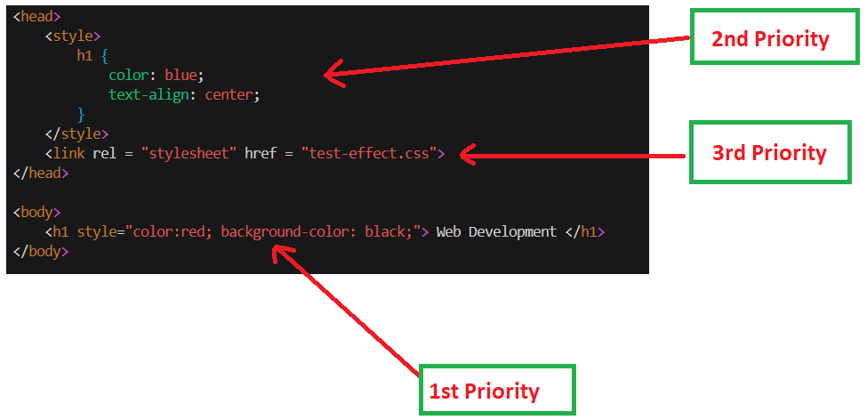
    <i>Priority of CSS </i>
</p>


## Selectors of CSS

<p>
    
</p>

- It refers to process of selecting an element in webpage.

CSS Selectors are classfied into various categories:
> Primary 
1.  Primary Selection 
2. Rational Selection 

> Pseudo selector
3. Dynamic pseudo classes 
4. Structural pseudo classes
5. Element pseudo classes
6. Validation state pseduo classes


> Basic Selector
7. Attribute selectors
8. Universal selectors
9. Root selector
10. Behavioural selector


### 1. Primary selector
- Id selector, type selector, class selector


### Type selector: 

- We target the element directly by referring to token.  

syntax :
```
<style>
    h1 {
        color : red;
    }
</style>
```

### Id selector: 
- Id refers to an identifying an element with unique names.
```
<head>
    <style>
        #library {
            color : red;
        }
    </style>
</head>

<body>
    <h1 id="library">REACT</h1>
</body>
```

> NOTE: In real time coding normally we write multiple designs (styles with effects ). To use this design on multiple element if we go for id selector then the effects would not be applied on the elements. To resolve this problem we go for class selector   

- When we give id like : id = "id1 id2", then no effect will be seen.
- But when we give the id like `<ele id="id1" id="id2" id="id3"...> </ele>`, so the first id will have effect on the element.

### CSS selector:

- If we want to apply multiple effects for an element, then we go for class selector.
Syntax: 

```
<style>
    .className1 {

    }
    .className2 {

    }
    .className3 {

    }
</style>

<body>
    <element class="className1 className2 className3 className4..."></element>
</body>
```

FAQ:

1. If styles are defined for any element in all 3 ways, then which set of effects would apply?
2. If style container is defined with same attributes in both head and body section, then which set of effect would apply?
3. If the style container is defined with same attribute muliptle times in body, then which set will apply?


FAQ-2:
1. If we define style for any element usinga all 3 primary selectors, which one will apply?

> Priority order : Id > class > type.
> If different attirbute will be present all will be applied.


2. If same attributes are defined using ID Selector in embeded and external file, which set will apply?
> The first will embed apply and then external will apply, but if we have same selector in botht place then the first which is appearing in code will have effect. (first come first serve)

> NOTE :
 ```
 <head>  <--- Browser memory (line by line interpretation would happen)
    <style></style>  
    <link src="" rel="stylesheet">
</head>
```

3. Is it possible to group the selectors to apply the same effects on different elements?

> Yes , we can do . 
Ex. : 
```
<style>
    .className, elementName, #idName {

    }
</style>
```

## 2. Rational Selector
- We can select elements using parent and child hierarchy.
- We can also select elements using siblings.

> `parent child` : all child elements in specific parent

> `parent > child` : only direct elements in specific parent

> `elementA + elementB` : Adjacent Selector [sibling]

> `elementA ~ elementB` : Generic sibling

Ex. 1: 

<p>
    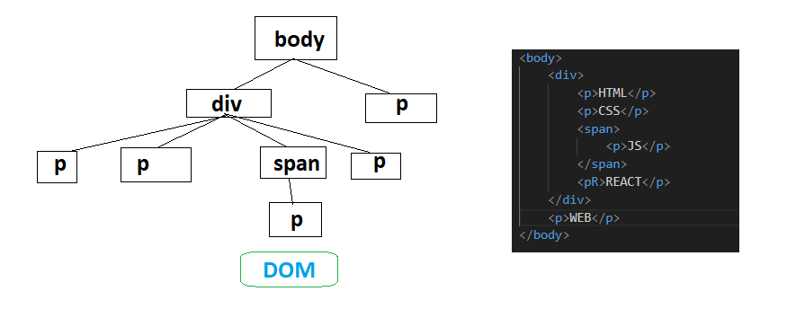
</p>

styling ex:
1. 


#### Ex. 2:
<p align=center>
    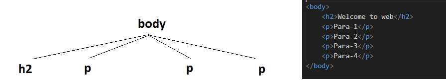
</p>


### 3. Attribute selector:

Syntax: 
```
elementName[attribute] {

}

elementName[attributeName=value] {

}
```

|Condition | Purpose|
|-|-|
|[attribute="val"]| Equal specifies that it should be exact match.|
|[attribute^="val"]| It refers the value starting with specified.|
|[attribute$="val"]| It specifies that the value ending with given term.|
|[attribute\|="val"]| Name starts with specified term and separated with "-"|
|[attribute\~="val"]| Name starts with specified term and not binded with other words|
|[attribute\*="val"]| It matches the term at any location|

### 4. Dynamic Pseudo class selector

- Dynamic indicates that the effect can change according to state and situation.
- Pseudo means false representation
- Class refers to program template in computer programming, it contains predefined logci and data which you can implement and customize according to the requirements.

|Selector | Description |
|--|--|
|:link| Specifies effect for hyperlink [anchor in default state]|
|:visited | It defines effects for visited links [anchor in visited state]|
|:target | It defines effects for the target element [ used normally in intradocument (not scrollable)]   [Element is target of specified hyperlink]|
|:hover | It defines effects when mouse pointer is over element. [ mouseover] |
|:active | It defines effects when link is in active state [ mousedown ]|

> NOTE: Class can transform element apperance, transformatin time can be controlled by using "CSS Attribute called `transition`."


### 5. Validation state pseudo classes
- On that particular element we are validating

|Selector | Description |
|--|--|
|:valid | It defines effects for element if is value is valid against the validation defined<br>Validation can be verified by using : <br>minlength, maxlength, required, pattern, email , url, etc.|
|:invalid | It defines effect for element when it is invalid|
|:required| It defines effects to element when it verified with required |
|:optional | If it is not defines with required validation then it is treated as optional|


### 5. Element state selector

|Selector | Description |
|--|--|
|:enabled | It defines effects when element is enabled|
|:disabled| It defines effects when element is disable|
|:read-only | It defines effects when element is set to read-only|
|:checked| It defines effects when element is checked|
|:focus| It defines effects when element get focus|

### 6. Structural pseudo selector

- You can target your effects based on the position of the element in parent and child hierarchy 

|Selector | Description |
|--|--|
|:first-child| It defines effect only for first child element|
|:last-child| It defines effects only for last child element|
|:nth-child(LevelNumber)| It defines effects only to specific child element that occurs at given level.<br>1.Level number starts with<br>2. Index number starts with 0.<br>You can also define the pre-set value like "even & odd" to apply effects based on even and odd occurences|
|nth-of-type(3|3n|3n+1)| Select elemens from top nth occurrence |
|nth-last-of-type(3n+1)| Select elemetns from bottom nth occurence |

Ex.:
<p align=center>
    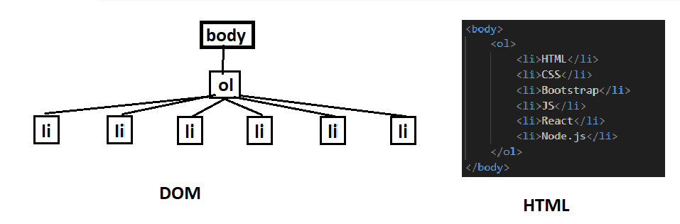
</p>

CSS Code : 

```
<style>
    ol li:first-child {    /* first item of list*/
        color : red;
    }
    ol li:last-child {   /* last item of list*/
        color: green;
    }

    ol li:nth-child(even) {  /* those items which are in even position */
        font-size: 30px;
    }
</style>
```

- 
<p align=center>
    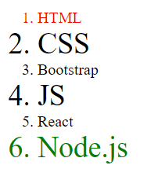
</p>


### 7. Behavioural and occurence class

<p>
    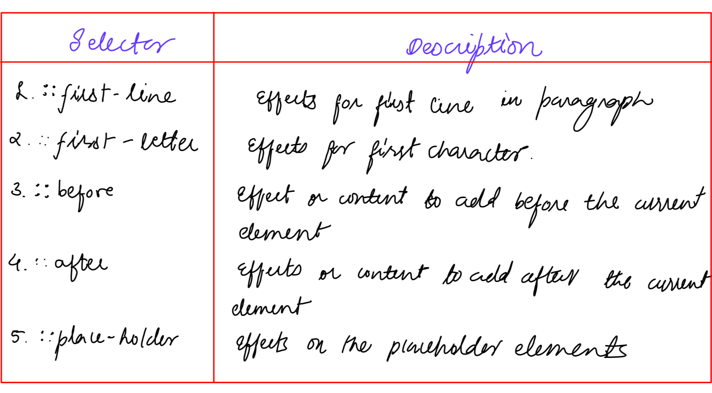
    <i></i>
</p>

### 8. Universal Selector

- It is mainly used for applying the effects for all the elements in a page.

- Syntax: 
```
<style>
    * {
        attribute1: value1;
        attribute2: value2;
        .
        .
        .
        attribute-n: value-n;
    }
</style>
```

### 9. Root Selector
- will be discussed in javascript

### 10. Language selector
- It is used to give the effects based on a langauge configured for an element. If your page contains multiple langauge data then to define the effects based on specific language , we go for langauge selector

- Syntax :
```
<style>
    elementName:lang(lang) {
        attribute1: value1;
        attribute2: value2;
        .
        .
        .
        attribute-n: value-n;
    }
</style>
```

## CSS Inheritance 

Ex.:

```
<!DOCTYPE html>
<html lang="en">
<head>
    <meta charset="UTF-8">
    <meta name="viewport" content="width=device-width, initial-scale=1.0">
    <title>INHERITANCE</title>

    <style>
        .container {
            border: 2px solid black;
            padding: 10px;
            margin: 15px;
            color: white;
            font-family: Brush script MT;
            background-color: black;
        }

        h1 {
            border: inherit;
            background-color: white;
            color: black;
        }

        p {
            font-family: initial;
        }
    </style>
</head>
<body>
    <div class="container">
        <h1>Web Development</h1>
        <p>HTML</p>
    </div>
</body>
</html>
```

<p>
    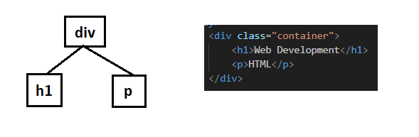<br>
    <p align="center">DOM</p>
</p>


Default nature of p and h1 :

```
p {
    display : block;
    margin-top: 1em;
    margin-bottom: 1em;
    margin-left: 0;
    margin-right: 0;
}

h1 {
    display : block;
    font-size: 2em;
    margin-top: 0.67em;
    margin-bottom: 0.67em;
    margin-left: 0;
    margin-right: 0;
    font-weight: bold;
}
```

- In CSS inheritance is the process of configuring parent effects to child elements.
- child elements automatically implements some of the parent feature which we can control by using following css values:
1. inherit
2. initial
3. unset

- All the properties of the parent will not reach to child, if we want it to reach to the child, then we use `inherit` value on that particular attribute all `all: inherit;` attribute
- After inheriting the attribute from the parent if the child is interesting in changing the value, the child can change the value or set the value to default apperance.
- To remove the default nature of a particular element we use `unset` value to the attribute   


## CSS box model

1. `margin`
1. `padding`
1. `border`
1. `border-radius`
1. `width`
1. `height`
1. `box-shadow`
1. `border-image`


### 1. `margin`
- It specifies the space around border.
- You define by using the following properties:
    - margin [short hand - sets in all direction]
    - margin-top
    - margin-bottom
    - margin-left
    - margin-right

Syntax:

```
{
    margin: 0px 0px 0px 0px; /*top , right, bottom, left*/
}
```

### 2. `padding`
- It specifies the space around content
- You can define
    - padding [short hand - sets in all direction]
    - padding-top
    - padding-bottom
    - padding-left
    - padding-right
- All options are similar like margin

Syntax:

```
{
    padding: 0px 0px 0px 0px; /*top , right, bottom, left*/
}
```

### 3. border

- `border` - short hand for style, color and width
- `border-style: dotted, double, dotted, solid, dashed, etc..; `
- `border-width: border-size;`
- `border-color: border-color;`
- `border-left` - short hand for style color and width
- `border-left-style` 
- `border-left-width` 
- `border-left-color` 

> Similarly for all directions [Indicates top, right, bottom]

### 4. border-radius

- `border-radius` - short hand for all directions (top-left, top-right, bottom-right, bottom-left)
- `border-top-right-radius`
- `border-top-left-radius`
- `border-bottom-right-radius`
- `border-bottom-left-radius`

- In order to make image to appear like a proper circle, width  and height value of an image should be made equal to border-radius value.

<p>
    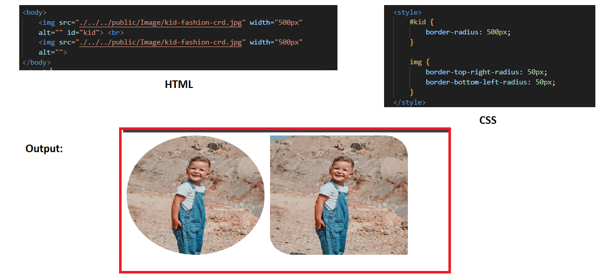<br>
</p>

### 5. border-image

- We can set image as border by using attributes like : border and border-image

Syntax:
```
<style>
    border: 10px solid transparent;
    border-image: url() stretch|space 1-100;  
</style>
```


### 5. CSS Units

- CSS units define size and position 
- They are used to define dimension and location of an elements in page.
- You can configure size with : height and width
- The css units are categorized into 2 groups
    - Absolute length units
    - Relative length units


1. Absolute Length units
- They are not relative to anything else and are generally considered as normal units.
- These are not affected by other relative elements and their units.
- They are not affected by parent or adjacent elements, they are individual and configured for various media devices.

|Unit| Name| Equivalent ID|
|--|--|--|
|cm| centimeters | 1cm = 96px/2.54 = 37px|
| mm| millimeters| 1mm =1/10th of 1 cm|
|Q	|Quarter-millimeters|	1Q = 1/40th of 1cm|
|in	|Inches|	1in = 2.54cm = 96px|
|pc	|Picas	|1pc = 1/6th of 1in|
|pt	|Points|	1pt = 1/72nd of 1in|
|px	|Pixels|	1px = 1/96th of 1in|


> NOTE : When we are creating an animations on a button click, if we want to zoom, the go for "Absolute Path",

> If we want to move the objects little far in a screen the go for "inch|cm|mm" 


2. Relative unit

- These are related to other content in the page.
- The size of any element can be determined based on its parent, child or adjacent.
- The advantege are whe nparent element size is change it will relatively affects the child element also.

|Unit| Relative to |
|--|--|
|em| It uses the font size of parent element and applies to current element.[element relative]<br>note : <br>1em -> 100% of parent element <br> 0.5em -> 50% of parent element|
|rem| Font size to the root element size[root element relative]|
|%|  Relative to view port|

- when we use `rem` we need to target the root element[`<HTML>`]


### 6. CSS Positions 

- Generally , elements are placed according to the documnet layour flow.
- Positions allow to make element behave differently and take time out of the document flow.
- CSS positions are defined by using "position" style attribute.
    1. Static
    2. absolute
    3. fixed
    4. sticky
    5. relaive

1. static
- This value would not disturb the layout of the page
- It keeps element according to normal flow of the document.
- Static position is not affected by top, right, bottom, left if defined.
- Generally in js, if we want to move the elements we can change it's place, but if we don't want to change then we need to take those elements as "static"
- While designing a responsive design also the element should not be changed dynamically, then we need to for position as "static".


2.  Absoulte
- It disturbs the flow layout of the page.
- It allows to change the position using top, bottom, left and right value.
- It attaches to the content in the paga and moves along with content in page.

3. Fixed
- It disturbs the normal flow, the position of the element is fixed when we use with top, left, right, bottom attributes.
- It attached to the browser of the page and it won't move along with content of the page.

4. sticky 
- It does not disturbs the layout of the page.
- It would not allow you to change the position.
- It can make the element sticky. After reaching to certain position.
 
5. relative

- It is defined for parent element
- The parent element keeps all child elements relative to the contextual
- It requires placement of child element using absolute
- Fixed will keep element regard to Page

## CSS Z-index
 

## CSS Display

Values of display are: 
1. none
2. block
3. inlint-block
4. inline
5. flex [for responsive design]
5. grid [for responsive design]


FAQ:
### 1. `none`
- What is the difference between `display: none` vs `visibility: hidden`
> `visibility: hidden` will not remove memory for that element on a page, whereas `display: none` would remove memory for an element on a page, as a result of which it disturbs the layout of the page.


### 2. `block`
- Content will appear in new line (`<br>`)

### 3. `inline`
- Content will appear in same line

### 4. `inline-block`
- To adjust the dimension of few html elements we use inline block. Ex., `<span>`, ``, `</anotesImg>`

### 5. `flex`
- Should be applied on a container not on element.
- By default the elements present in inside a container would be arranged "row" wise.
- If we apply `display: flex;` on elements, we get abnormal behaviour as the response.
- Flex would support adjusting the elements in both <u>row and column wise</u>
- `display: inline` is applicable only for elements, not for container.

NOTE :
```
{
    display : flex;
    flex-direction: column;
}
```
> The elements present in the container would be adjusted as per width of the container, if the flex-direction is row then the elements present in the container would be adjusted as per the height of the container.

Ex. 1:

<p>
    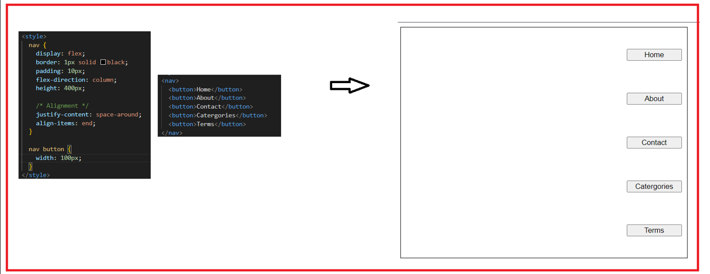
</p>

<p>
    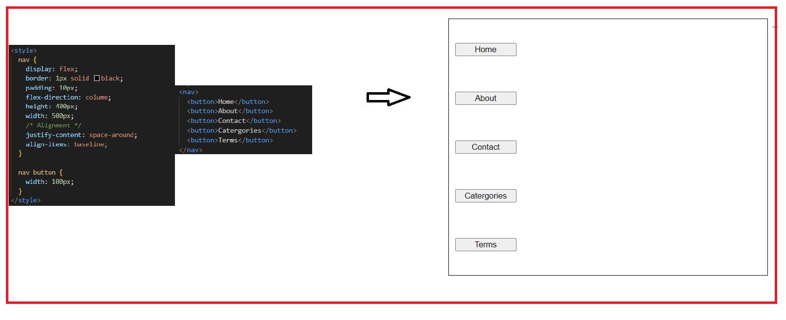
</p>
<p>
    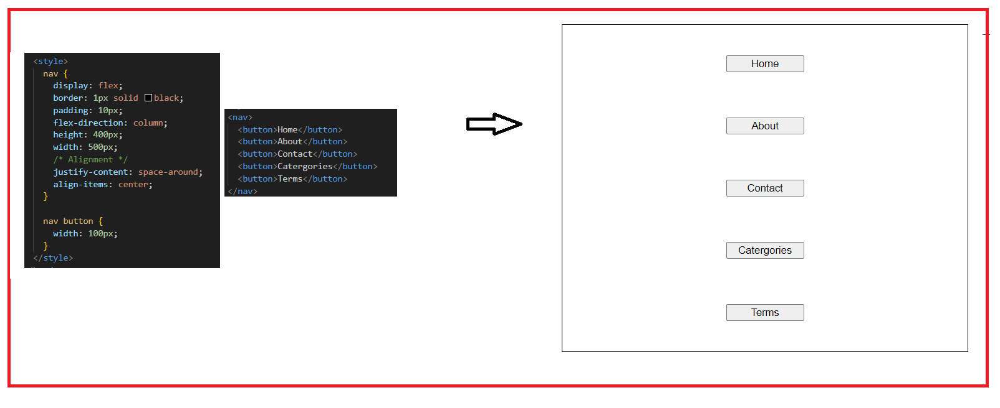
</p>
<p>
    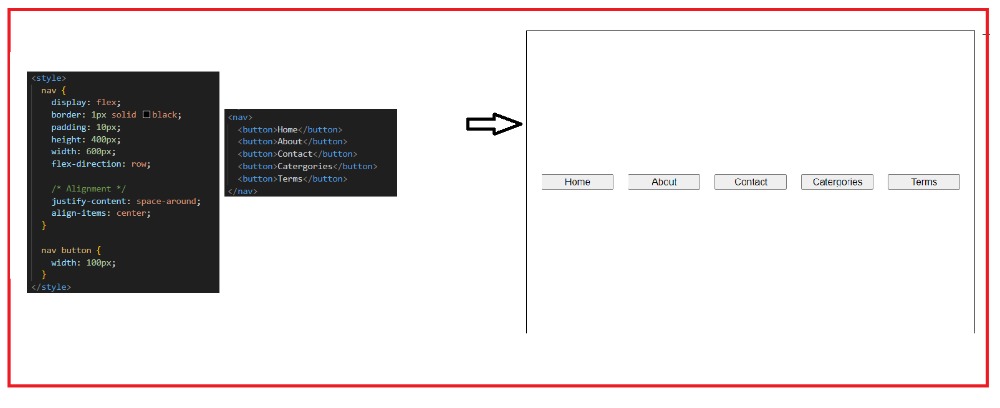
</p>


<p>
    
</p>

<p>
    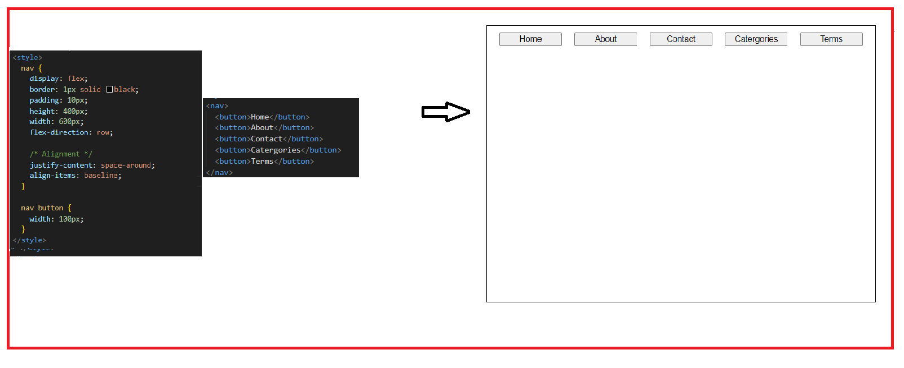
</p>


- flex-wrap
> In order tp wrap the element within the container we go for `flex-wrap: wrap;`.
> If we set the container to wrap, the elements would span to multiple row, depending upon width of the element 

```
.container {
    display: flex;
    flex-wrap: wrap;
}
```

- elements will be adjust in container by to multiple row as per the screen adjustment(It will not shrink the content)


##  CSS background
1. background-color
1. background-image
1. background-size
1. background-attachment
1. background-repeat

NOTE: 
1. background-color: `rgb`   
1. background-image: `url("")`
1. background-repeat: `no-repeat`, `repeat-x`, `repeat-y`, `repeat`
1. background-attachment: `fixed`, `scroll`
1. background-position: `left`, `right`, `center` | `top`, `center`, `bottom`
1. background(shorthand property): color image repeat position;

Syntax:
    ```
    background: #fffff url("img.png") no-repeat right top;
    ```

FAQ:

q. Can we set a multiple background images?

> Yes, it is possible but we need to control the alignment

Code: 
```
<!DOCTYPE html>
<html lang="en">
<head>
    <meta charset="UTF-8">
    <meta name="viewport" content="width=device-width, initial-scale=1.0">
    <title>Document</title>
    <style>
        body {
            height: 100vh;
            width: 100vw;
            background-image: url("./../../public/Image/zoro.jpg"), url("./../../public/Image/saitama.jpg");
            background-repeat: no-repeat, repeat;
            background-size: 20% 100%, 30% 90%;
            background-position: center center, top left;
        }
    </style>
</head>
<body>
    
</body>
</html>
```

Output:
<p>
    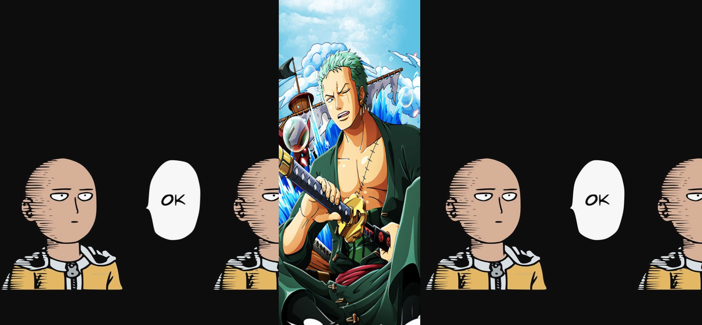
</p>
Q. Can we change background image dynamically?

Q. Can we give background color and background image both?
> Yes:

```
<!DOCTYPE html>
<html lang="en">
<head>
    <meta charset="UTF-8">
    <meta name="viewport" content="width=device-width, initial-scale=1.0">
    <title>Document</title>
    <style>
        body {
            height: 100vh;
            display: flex;
            justify-content: center;
            align-items: center;
        }
        .container {
            width: 600px;
            height: 600px;
            border: 1px solid black;
            background-color: black;
            background-image: url("./../../public/Image/One\ Piece.png");
            background-repeat: no-repeat;
            background-size: 40% 30%;
            background-position: center center;
        }
    </style>
</head>
<body>
    <div class="container">

    </div>
</body>
</html>
```
<p>
    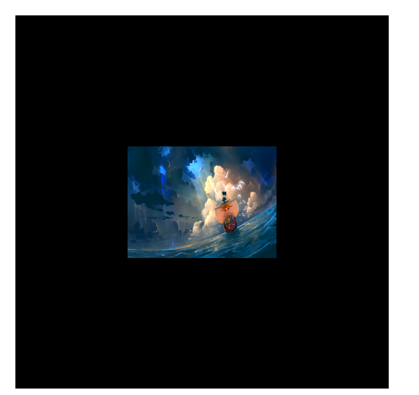
</p>


## CSS text effects
- font-family
- font-weight
- font-variant: small-caps[all lower case letters convert into capital letters and font size is small]
- font-style
- font-size

CSS text effects:

1. text-align: left| center| right| justify
1. text-shadow: (same like box shadow)
1. text-indent: first line of the paragraph with some space(length | initial| inherit )
1. text-transform: uppercase, lowercase, capitalize
1. text-overflow: it can display overflowing text chars like ellipsis
1. text-decoration: overline, underline, linethrough, size, color

Short hand for `text-decoration:`
```
    text-decoration: text-decoration-line text-decoration-style text-decoration-color thickness
```
While working with paragraph:
1. line-height: space b/w lines;
2. word-space: space b/w words;
2. letter-space: space b/w letters;
4. word-break: breaks lengthy words are right margin of paragraph.
5. white-space: it controls wrapping of text in the container (nowrap)
6. overflow: hidden| scroll | auto

## Media query 

- It is associated with making a page as responsive

- Media have type : screen|print|speech
- Media have orientation : landscape| potrait
- media have min-width & max-width

- min-width: it defines the value starting from specified units to end. Eg: `min-width: 600px;` (starting from 600 =px to end) 
```
@media (width<=..px) {
    
}
```
- max-width: It defines the value starting from 0px to specified units. Eg, `max-width:400px;` (startinng from 0px to 400px)
@media (width>=..px) {

}


## CSS Animation, CSS 2d, CSS 3d
- Remaining 


# Bootstrap Components
- Linking jQuery

```
<!DOCTYPE html>
<html lang="en">
<head>
    <meta charset="UTF-8">
    <meta name="viewport" content="width=device-width, initial-scale=1.0">
    <link rel="stylesheet" href="../../../node_modules/bootstrap/dist/css/bootstrap.css">
    <link rel="stylesheet" href="../../../node_modules/bootstrap-icons/font/bootstrap-icons.css">
    <title>Document</title>
</head>
<body>
    
    <script src="../../../node_modules/jquery/dist/jquery.js"></script>
    <script src="../../../node_modules/bootstrap/dist/js/bootstrap.bundle.js"></script>
</body>
</html>
```

- NOTE : For scripts order is compulsory, first keep jquery.js and later keep bootstrap.bundle.js
- We can use complete bootstrap library except "poper" we will learn poper at the end.


### Classes:
1. `.alert`
1. `.alert-{contextual}` : primary, success, danger, info, warning etc..
3. `.alert-dismissible`'
4. `.alert-heading`

## Jquery Attributes
- bootstrap components use jQuery attributes to configure and handle functionality 
- Bootstrap-5 version defines the attributes using "data-bs-{}"
- Bootstrap upto 4 version defines the attributes using "data-{}".
- Bootstrap jQuery attributes are of various types:
    1. `data-bs-target`
    1. `data-bs-toggle`
    1. `data-bs-dismiss`
    1. `data-bs-slide`
    1. `data-bs-ride` 

> To close any componenet in bootstrap you can attach the attribute called `data-bs-dismiss` to any clickable element like [button, links]
```
    <button class="btn btn-close" data-bs-dismiss="alert">
```

## Card classess in bootstrap
1. `.card`
2. `.card-header`
3. `.card-body`
3. `.card-footer`
5. `.card-title`
6. `.card-subtitle`
7. `.card-img-top`

## Pagination classess in bootstrap

1. `pagination`
2. `page-item`
3. `page-link`
3. `active`
3. `disabled`

## Carousel classess
1. `.carousel`
1. `.carousel-inner`
1. `.carousel-item`
1. `.carousel-fade`
1. `.carousel-slide`

Syntax : 
```
<div class="carousel">
    <div class="carousel-inner">
        <div class="carousel-item">
        // content
        </div>
        // Add multiple items
    </div>
</div> 
```

- Carousel item cannot display any item directly 
- Carousel can't start the animation directly, we need to define the attribute "data-bs-ride" for carousel
    `<div class="carousel" data-bs-ride="carousel">`

- Carousel doesn't have any defualt transition, we have to set the transition using classes
1. slide
2. carousel-sllde

- Adding carousel indicators to the items
### Carousel controls 
- You can add controls for carousel so that user can navigate to previos and next slide 

Classes : 
1. `.carousel-control-prev`
1. `.carousel-control-prev-icon`
1. `.carousel-control-next`
1. `.carousel-control-next-icon`

> Carousel controls are normall buttons

- Carousel controls needs jQuery attributes to handle navigation
1. `data-bs-slide="prev"`
1. `data-bs-slide="next"`
1. `data-bs-target="#carouselID"`

> NOTE : It is also possible to control the transition time of each carousel items

Syntax : `data-bs-interval="time_in_milliseconds"` : Give it to `carousel-item`

### Carousel indicators

- Indicators allow to navigate randomly
- WE can navigate to any slide directly by using indicators

### Class 
1. `.carousel-indicators`

- Usually indiactors is a collection of buttons
- Indicators requre JQuery attrubute `data-bs-slid-to="IndexNumber(0-based))"`

- Any one indicator must be active 
```
<div class="carousel-indicators">
    <button class="active" data-bs-target="#banner" data-bs-slide-to="0"></button>
    <button  data-bs-target="#banner" data-bs-slide-to="1"></button>
    <button  data-bs-target="#banner" data-bs-slide-to="2"></button>
</div>
```

## Modal 
#### Classes : 
1. `.modal`
1. `.modal-dialog`
1. `.modal-content`
1. `.modal-header`
1. `.modal-body`
1. `.modal-footer`

Syntax : 
```
<div class="modal">
|
    <div class="modal-dialog">
    |        
        <div class="modal-content">
        |
            <div class="modal-header">
            | 
            </div>

            <div class="modal-body">
            |
            </div>
            
            <div class="modal-footer">
            |
            </div>
        |    
        </div>
    |   
    </div>
|
</div>
```

Few other classes:<br>
We can control the position using the classes :
1. `.modal-dialog-centered`
1. `.modal-fullscreen`
1. `.modal-dialog-scrollable`


### Spinner-component 
- It is used to show status of any task performed in a page <br>
classes : 
1. `.spinner-border`
1. `.spinner-border-sm|lg`
1. `.spinner-grow`
1. `.spinner-grow-sm|lg`

attributes
1. `.data-bs-target` (Specify the element we target)
2. `.data-bs-toggle` (specify the component)

### Accordion classes

1. `.accordion`
2. `.accordion-header`
2. `.accordion-body`
2. `.accordion-collapse`
2. `.accordion-item`
2. `.accordion-button`
2. `.show`
2. `.collapse`


Syntax : 
```

```


### Dropdown in bootstrap 

1. `.dropdown`
1. `.dropup`
1. `.dropend`
1. `.dropstart`
1. `.dropdown-toggle`
1. `.dropdown-menu`
1. `.dropdown-item`
1. `.dropdown-divider`

Attribute : 
1. data-bs-toggle

### nav with tabs in bootstrap

1. `.nav`
1. `.nav-menu`
1. `.nav-item`
1. `.nav-text`
1. `.nav-link`
1. `.nav-tabs`
1. `.nav-pills`
1. `.nav-content`
1. `.nav-pane`

