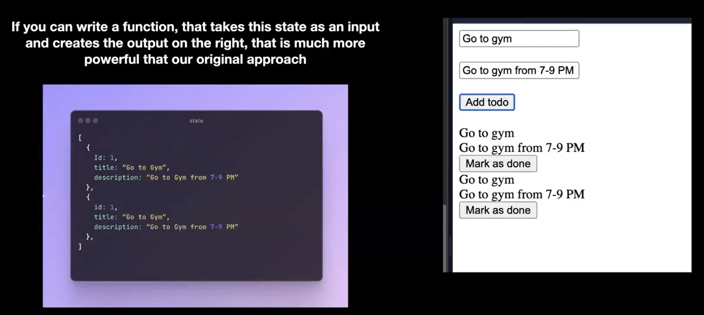

# Why we need react or frontend framework?

## Simple to-do app involving dom-manipulation

- Here we need to create multiple div elements and append it to the child, we just have one function called to add, but in real world we'll have live updates, we need to update it constantly.

> Javascript code:

```js
let globalId = 1;
function completeTodo(id) {
  console.log(id);

  const todo = document.getElementById(id);
  todo.children[2].innerHTML = "Done";
}

function createChild(title, desc, id) {
  const child = document.createElement("div");
  const child1 = document.createElement("div");
  child1.innerHTML = title;
  const child2 = document.createElement("div");
  child2.innerHTML = desc;
  const button = document.createElement("button");
  button.innerHTML = "Mark as done";
  child.setAttribute("id", id);
  button.setAttribute("onclick", `completeTodo(${child.getAttribute("id")})`);
  child.append(child1);
  child.append(child2);
  child.append(button);
  return child;
}

function addTodo() {
  const title = document.querySelector("#title");
  const desc = document.querySelector("#desc");
  document
    .querySelector("#to-dos")
    .appendChild(createChild(title.value, desc.value, globalId++));
}
```

- For creating we need to use DOM manipulation. The code for this simple app is compilcated and ugly so for complex app, the complication of the code will increase.
- Hence for managing this we need easier way, that is solved by frontend framework.

- We'll have **State** of these todo. And we need to update it accordingly
- Next task:



- We'll be getting array of an object, and from there we need ro create the dom
- use following url

```md
https://dummyjson.com/todos
```

- update code:

```js
// implementing dynamic update: state

function updateDomAccToState(data) {
  const parent = document.querySelector("#to-dos");
  for (let i = 0; i < data.length; i++) {
    parent.append(createChild(data[i].todo, "some descit", data[i].id));
  }
}

setInterval(async function () {
  const res = await fetch("https://dummyjson.com/todos");
  const data = await res.json();
  updateDomAccToState(data.todos);
}, 5000);
```

- Now here we can see that it's always appending the new todos to end of the existing list, what if there are duplicate? or completed todos? so we need to update the todo list everytime.

- somehow we need to find the difference between the new state and old state and update accordingly.
- This is what react does, according to the state it will update and append the new data.


