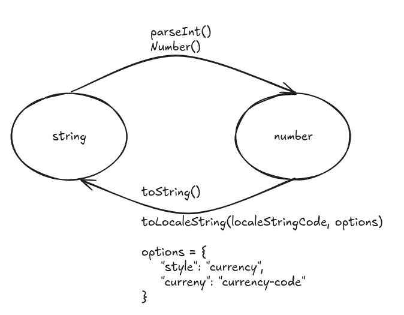

# Javascript

## `var`, `let` and `const`

### Tabular difference between above three

|**Feature**| `var` | `let` | `const` |
|----|----|----|----|
| **Scope** | Function-scoped | Block-scoped| Block-scoped |
| **Hoisting**| Yes (initialised as `undefined`| Yes (but not initialised) | Yes (but not initialised)|
| **Can be reassigned**| Yes| Yes | No|
| **Can be redecalred**| Yes| No| No|
| **Temporal Dead Zone**| No| Yes| Yes|
| **Use In loops**| Not safe(due to functional scope) | Safe | Safe(If No reason) |

## Variable naming rules

1. Name must start with an alphabet or can start with _ or $.
2. _ is used for configures lot of constructs.
  _ refers that variable requires further implementations
  ```Javascript
  var productName; // its funcionality is final
  var _productName; // Representation : it is not yet implemented
  ```
3. Don't use special chars in variable.
4. Name can be alpha numeric.
  ```Javascript
  var product2020;
  ```
5. Name is case sensitive.
6. Name can be max 255 chars long
7. Avoid using single char and long variable name.
8. Avoid using keyword[Total 45 reserved words]
  ```Javascript
  var const; // Invalid
  var if;    // Invalid
  ```
9. Always use camel case for name and it should speak what it is?
  ```Javascript
    var u = "Sachin";  // not a good approach
    var userName = "Sachin"; // good approach
  ```


## Javascript Datatypes

- There is no datatype for user
- It is implicitly types (depending upon the values its type would be determined)
- It is dynamically typed language

Browser Engine:

  1. **For user**: No need to explicitly mention the type (Dynamically typed)
  2. **For Browser Engine**: To process the input, it uses datatypes concept.

  - Two types of datatypes:

    - 1. Primitive Types
        - Structure is defined : range and size is fixed
       - Immutable: Changes can't be made in the same memory - if we try to change, those changes will be reflected in the new memory
        - memory will stack area
        - Ex: numeber, string, Boolean, null, undefined, BigInt, Symbol

    - 2. Non-Primitive Types
        - Structure is not defined
        - Memory will be in Heap
        - Mutable : Changes is permitted in the same memory
        - Ex.: Array, Object, Date, RegEx, functions

Example:
```Javascript
funcion add(a, b) {
  console.log(a + b);
}

add(10, 20);             // number, number
add("Shoyeb", "Ansari"); // string, string
add("Shoyeb", 980);      // number, string
```

## Javascript Object vs JSON

1. Javascript Object = `{ key: value }`
    - To convert js object to JSON : `JSON.stringify(jsObj)`
2. JSON Object  = `{ "key" : value }`
    - To convert js object to JSON : `JSON.parse(jsonString)`

Code Example:
```Javascript
let user = {
  id: 10,
  name: "Shoyeb",
  isMarried: true
};
console.log(user);
let jsonUser = JSON.stringify(user);
console.log(jsonUser);

let product = `{ "id": 1, "productName": "Samsug Galaxy", "price": 123}`;
console.log(product);

let productJsObject = JSON.parse(product);
console.log(productJsObject);
```

## Numerical Data Type in Javascript

### Number Data Type in Javascript

> Javascript stores all numbers(whether types by user or written in code) using **IEEE 754 double-precision floating point format**(64-bit float)

| **Bits** | **Purpose**                       |
| -------- | --------------------------------- |
| 1 bit    | Sign (0 = positive, 1 = negative) |
| 11 bits  | Exponent (with bias of 1023)      |
| 52 bits  | Mantissa/Fractional digits        |

| **Concept**           | **JavaScript (`number`)** |
| --------------------- | ------------------------- |
| Max safe integer      | 2⁵³ - 1                   |
| Precision above limit |  Lost                    |
| Alternative           | `BigInt`                  |


- Since number is floating point type it leads to precision issues

Ex:
```js
console.log(0.1 + 0.2); // 0.300000000000002

console.log((0.1 + 0.2).toFixed(2)); // 0.30
```

### BigInt

> To store any large integer number with precision, we use BitInt.

Ex.:

```js
let c = 9007199254740991n;
console.log(c);
console.log(c == c + 1); // false [No loss of precision]
```

### To convert the data from String to format to number type we have 3 mechanisms

1. `Number()`: `number`
-  It expects the data to strictly in number type only if any special symbols are part of data then it would throw "NaN"
Ex:
```Javascript
console.log(Number("20")) // 20
console.log(Number("20A")) // NaN
console.log(Number("A20")) // NaN
```

2. `parseInt()`: `number`
- It also expects the input in string type
- It returns the number till it encounter the special character
- If first character itself is a any character apart from digits then it will return "NaN"

```Javascript
console.log(parseInt("20")) // 20
console.log(parseInt("20A")) // 20
console.log(parseInt("A20")) // NaN
```

### `isNaN` and `Number.isNaN`

|`isNaN(input)` | `Number.isNaN(input)`|
|------|----------|
|Convert the input into number type using Number(), if it is NaN then it returns "true" otherwise "false"| It doesn't do any conversion, on the input it checks whether it is NaN: true, otherwise: false |

> Note : While performing '+' operation if one of the operand is `NaN` then the output would be `NaN`
Example usecase of isNaN using Browser api prompt:

```Javascript
let age = prompt("Please enter the age").trim();

if (age == null) {
  console.log("No age enetered, you pressed cancle or escape button");
}
else if (age == " " || isNaN(age)) {
  console.log("Please enter the correct age")
}
else {
  console.log("Age is : ", age);
}
```

### `toLocale()` for numbers

<p>
    
</p>

- Locale-encode and currency

| Locale  | Currency Code | Country        |
| ------- | ------------- | -------------- |
| `en-US` | `USD`         | United States  |
| `en-GB` | `GBP`         | United Kingdom |
| `de-DE` | `EUR`         | Germany        |
| `fr-FR` | `EUR`         | France         |
| `ja-JP` | `JPY`         | Japan          |
| `hi-IN` | `INR`         | India          |
| `zh-CN` | `CNY`         | China          |
